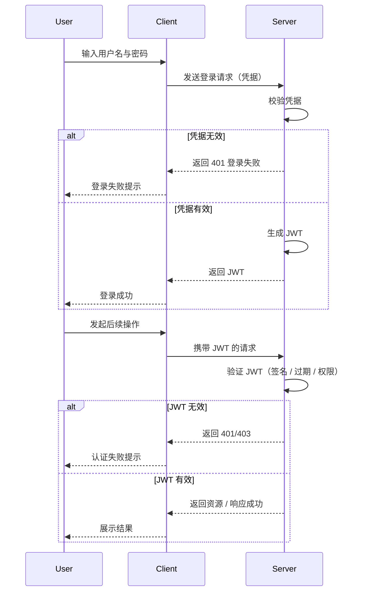

JWT，全称 *JSON Web Token*，是一种使用加密签名保护的 JSON 数据，定义在 [RFC 7519](https://www.rfc-editor.org/rfc/rfc7519) 中。
它通常用于 Web 应用和 API 中，用于验证用户身份，防止未经授权的访问。

<!-- more -->

与传统服务端 Session 不同，JWT 是无状态的，服务端无需存储会话信息，因此非常适合分布式系统和微服务架构。

## JWT 的结构

JWT 主要由三部分构成，每部分均采用 `Base64` 编码存储，中间用 `.` 分隔：

```
Header.Payload.Signature
```

1. *Header*：包含 Token 的元数据，例如用于签名的算法。
2. *Payload*：存储声明，例如用户的身份和权限、Token 过期时间等。
3. *Signature*：使用密码加密后得到的签名，用于保证数据的真实性和完整性。

可以在 [JWT Debugger](https://www.jwt.io) 中在线尝试下 JWT 的编解码过程。

### Header

Header 中存储了 Token 的元数据，包括签名算法和令牌类型：

```json
{
  "alg": "HS256",
  "typ": "JWT"
}
```

- `alg`：指定签名算法。常用：
  - `HS256`（HMAC + SHA-256）：对称加密算法，兼顾效率与安全性，适合小项目。
  - `RS256`（RSA + SHA-256）或 `ES256`（ECDSA + SHA-256）：非对称加密，适合高安全需求。
- `typ`：指定类型，一般设置为 `JWT`，应用程序可通过该项来区分不同类型的对象。

### Payload

Payload 中可以存储任意字段，供服务端获取用户身份、检验用户权限等需求：

```json
{
  "sub": 328913,
  "aud": "web",
  "role": "admin",
  "exp": 1733631682
}
```

此外，RFC 7519 中定义了一些**标准字段**，推荐使用但不强制：

| 字段    | 全称            | 含义                                        |
| ------- | --------------- | ------------------------------------------- |
| **iss** | issuer          | 签发者标识。通常是系统名、域名或服务名称。  |
| **sub** | subject         | 主题，一般用于用户唯一标识（user ID）。     |
| **aud** | audience        | 令牌的接收方，例如 `web` `mobile` `api`。      |
| **exp** | expiration time | 过期时间（Unix 时间戳）。必须大于当前时间。 |
| **nbf** | not before      | 起始生效时间。例如 Token 10 秒后才生效。    |
| **iat** | issued at       | 签发时间（Unix 时间戳）。                   |
| **jti** | JWT ID          | 用作令牌的唯一标识，可用于黑名单等场景。    |

::: warning 不要存储敏感信息
Payload 仅通过 Base64 编码，未被加密，可直接解码，不适合存储敏感信息。 
:::

### Signature

签名用于保证 Token 的真实性与完整性，它使用 Header、Payload 和密钥生成：

```js
HMACSHA256(
  base64UrlEncode(header) + "." + base64UrlEncode(payload),
  secret
)
```

密钥仅在服务端存储，不能泄露。

## JWT 的工作流程

1. **登录请求**：用户通过客户端向服务端发送身份凭据（如用户名和密码）用于登录。
2. **生成 JWT**：服务端验证用户发送的身份凭据，如果凭据正确，将使用密钥生成 JWT。
3. **返回 JWT**：服务端将 JWT 发送给客户端。
4. **后续请求附带 JWT**：对于任何后续请求，客户端将随请求一起发送 JWT。
   服务器在处理请求前会验证 JWT，如验证签名、判断是否过期、验证权限等。



## JWT 的传输

### 使用 HTTP 头

服务端通过 HTTP 响应体返回相应的 Token：

```json
{
  "access_token": "<JWT_ACCESS>",
  "refresh_token": "<JWT_REFRESH>"
}
```

客户端将 Token 存储在 localStorage 或 sessionStorage 中，在后续请求中通过 `Authorization` 头传递：

```http
GET /api/profile
Authorization: Bearer <JWT_ACCESS>
```

这种方式简单直观，可以提供较高的灵活性，但是存储在 localStorage 或 sessionStorage 中容易受 XSS 攻击。

### 使用 Cookie

服务端通过 `Set-Cookie` 头同时传递 JWT `access_token` 和 `refresh_token`：

```http
HTTP/2.0 200 OK
Set-Cookie: access_token=<JWT_ACCESS>; HttpOnly; Secure; SameSite=Strict; Path=/; Max-Age=900
Set-Cookie: refresh_token=<JWT_REFRESH>; HttpOnly; Secure; SameSite=Strict; Path=/refresh; Max-Age=604800
```

::: warning 安全提示
Cookie 配合 `HttpOnly` + `Secure` + `SameSite` 能防止 XSS 与部分 CSRF 攻击。

`refresh_token` 仅允许在 `/refresh` API 中使用，降低泄露风险。
:::

客户端在发起 HTTP 请求时会自动携带相应的 Cookie，无需手动传递。

## 安全使用 JWT

1. **选择安全的加密算法**：对于普通项目，建议采用 `HS256`，有更高安全性需求可以使用 `RS256` 或 `ES256` 等非对称加密算法。
2. **保护密钥安全**：密钥不要硬编码在客户端或前端，可使用环境变量或安全存储来管理密钥，并定期轮换。
3. **控制 Token 生命周期**：JWT 一旦签发，通常无法撤销。应设置合理的过期时间，避免长生命周期 Token，推荐：
   - **Access Token**：短期有效（几分钟到几小时）。
   - **Refresh Token**：长期有效（几天到几周），用于获取新的 Access Token。
   - 可结合短期 Access Token + 服务端黑名单机制，实现即时注销。
4. **不存储敏感信息**：JWT 采用 Base64 编码，任何人都能解码，只能防篡改，不能防泄露，不能依赖 JWT 存储敏感数据。
5. **使用 HTTPS**：使用 HTTPS 传输 Token，防止被中间人窃取。
6. **使用安全的存储方式**：建议 HttpOnly Cookie 存储，并设置 `Secure` 和 `SameSite`。
   不建议使用 localStorage，容易遭到 XSS 攻击。

## 参考资料

- [JSON Web Token (JWT) | GeeksforGeeks](https://www.geeksforgeeks.org/web-tech/json-web-token-jwt/)
- [RFC 7519](https://www.rfc-editor.org/rfc/rfc7519)
