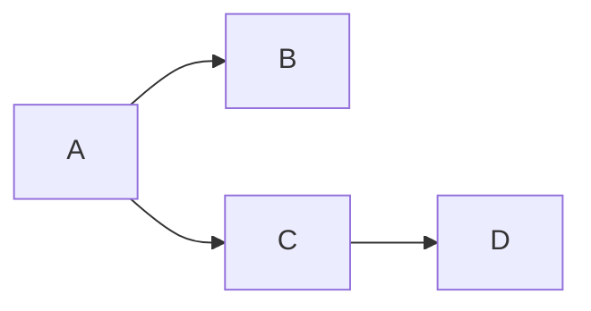

本指南涵盖 gMock 的高级使用技巧。
建议先阅读 [gMock 入门基础](gmock_for_dummies.md)掌握基本概念。

::: note 命名空间说明
gMock 定义在 `testing` 命名空间中。
为提高代码的可读性，建议在使用 gMock 定义的名称之前，先在文件中使用 `using ::testing::Foo;` 声明。
本文为简洁省略了这些声明，但实际开发中应这样做。
:::

## 创建模拟类

模拟类的定义与普通类类似，但需使用 `MOCK_METHOD` 宏来声明模拟方法。
该宏接受 3 个或 4 个参数：

```cpp
class MyMock {
 public:
  MOCK_METHOD(ReturnType, MethodName, (Args...));
  MOCK_METHOD(ReturnType, MethodName, (Args...), (Specs...));
};
```

前 3 个参数对应方法声明的三个部分。
第 4 个参数（可选）为修饰符列表，支持：

- `const` - 添加 `const` 标记。重写 `const` 方法时必须使用。
- `override` - 添加 `override` 标记。重写虚函数时建议使用。
- `noexcept` - 添加 `noexcept` 标记。重写 `noexcept` 方法时必须使用。
- `Calltype(...)` - 指定调用约定（_call type_，例如 `STDMETHODCALLTYPE`），针对 Window 系统。
- `ref(...)` - 指定引用限定符，如 `ref(&)` 或 `ref(&&)`。重写带引用限定符的方法时必须使用。

### 处理未受保护的逗号

当返回类型或参数类型包含未用括号包裹的逗号时，会导致 `MOCK_METHOD` 宏解析错误：

```cpp
class MockFoo {
 public:
  // [!code error:2]
  MOCK_METHOD(std::pair<bool, int>, GetPair, ());  // 编译失败
  MOCK_METHOD(bool, CheckMap, (std::map<int, double>, bool));  // 编译失败！
};
```

#### 解决方案 1：括号包裹

```cpp
class MockFoo {
 public:
  // [!code focus:2]
  MOCK_METHOD((std::pair<bool, int>), GetPair, ());
  MOCK_METHOD(bool, CheckMap, ((std::map<int, double>), bool));
};
```

::: note
虽然常规 C++ 语法不支持类型外包裹括号，但 `MOCK_METHOD` 会自动去除这些括号。
:::

#### 解决方案 2：类型别名

```cpp
class MockFoo {
 public:
  // [!code focus:4]
  using BoolAndInt = std::pair<bool, int>;
  MOCK_METHOD(BoolAndInt, GetPair, ());
  using MapIntDouble = std::map<int, double>;
  MOCK_METHOD(bool, CheckMap, (MapIntDouble, bool));
};
```

### 模拟私有/保护方法

无论被模拟的方法在基类中的访问权限如何，模拟方法都必须被声明在模拟类的 `public` 区段，
以便 `ON_CALL` 和 `EXPECT_CALL` 能在模拟类外部使用这些模拟方法。（C++ 允许子类修改基类中虚函数的访问级别。）

```cpp
class Foo {
 public:
  ...
  virtual bool Transform(Gadget* g) = 0;

 // [!code highlight:2]
 protected:
  virtual void Resume();

 // [!code highlight:2]
 private:
  virtual int GetTimeOut();
};

class MockFoo : public Foo {
 public:
  ...
  MOCK_METHOD(bool, Transform, (Gadget* g), (override));

  // [!code highlight:2]
  // 基类中的 protected 方法
  MOCK_METHOD(void, Resume, (), (override));

  // [!code highlight:2]
  // 基类中的 private 方法
  MOCK_METHOD(int, GetTimeOut, (), (override));
};
```

### 模拟重载方法

重载方法可以正常模拟，无需任何特殊处理：

```cpp
class Foo {
  ...

  // 注意这里必须是虚函数
  virtual ~Foo();

  // 根数参数类型和数量重载
  virtual int Add(Element x);
  virtual int Add(int times, Element x);

  // 根据 const 属性重载
  virtual Bar& GetBar();
  virtual const Bar& GetBar() const;
};

class MockFoo : public Foo {
  ...
  MOCK_METHOD(int, Add, (Element x), (override));
  MOCK_METHOD(int, Add, (int times, Element x), (override));

  MOCK_METHOD(Bar&, GetBar, (), (override));
  MOCK_METHOD(const Bar&, GetBar, (), (const, override));
};
```

::: warning
如果没有覆盖方法的所有重载版本，编译器会警告说基类中的某些方法被隐藏了。
要解决这个问题，可以使用 `using` 将这些方法引入作用域：

```cpp
class MockFoo : public Foo {
  ...
  // [!code focus:3]
  using Foo::Add;
  MOCK_METHOD(int, Add, (Element x), (override));
  // 我们不打算模拟 int Add(int times, Element x)
  ...
};
```

:::

### 模拟类模板

模拟类模板与模拟普通类相同：

```cpp
template <typename Elem>
class StackInterface {
  ...
  virtual ~StackInterface();

  virtual int GetSize() const = 0;
  virtual void Push(const Elem& x) = 0;
};

template <typename Elem>
class MockStack : public StackInterface<Elem> {
  ...
  MOCK_METHOD(int, GetSize, (), (const, override));
  MOCK_METHOD(void, Push, (const Elem& x), (override));
};
```

### 模拟非虚方法 {#mocking-non-virtual-methods}

gMock 可以通过模板模拟非虚方法，实现高性能依赖注入。
在这种情况下，模拟类与真实类并不需要共同基类，只需包含具有相同签名的方法。

模拟非虚方法的语法与模拟虚方法相同，只是不需要添加 `override`：

```cpp
// 一个简单的数据包流类，它的成员都不是虚函数
class ConcretePacketStream {
 public:
  void AppendPacket(Packet* new_packet);
  const Packet* GetPacket(size_t packet_number) const;
  size_t NumberOfPackets() const;
  ...
};

// 一个模拟的数据包流类，它不继承任何类，但定义了 GetPacket() 和 NumberOfPackets()
class MockPacketStream {
 public:
  MOCK_METHOD(const Packet*, GetPacket, (size_t packet_number), (const));
  MOCK_METHOD(size_t, NumberOfPackets, (), (const));
  ...
};
```

::: note
与真实类不同，这里模拟类没有定义 `AppendPacket()`。
只要测试不需要调用它，这样做没问题的。
:::

接下来，需要一种方式来表示在生产代码中使用 `ConcretePacketStream`，而在测试中使用 `MockPacketStream`。
由于这些函数不是虚函数，且两个类没有关联，必须在**编译时**（而不是运行时）指定它们。

我们可以通过模板参数切换来实现。
具体来说，即为代码提供一个模板类型参数来表示数据包流的类型。
在生产代码中，使用 `ConcretePacketStream` 来实例化模板；在测试中，则使用 `MockPacketStream`。
例如，可以这样定义：

```cpp
// [!code highlight]
template <class PacketStream>
void CreateConnection(PacketStream* stream) { ... }

// [!code highlight]
template <class PacketStream>
class PacketReader {
 public:
  void ReadPackets(PacketStream* stream, size_t packet_num);
};
```

然后，在生产代码中使用 `CreateConnection<ConcretePacketStream>()` 和 `PacketReader<ConcretePacketStream>`，
而在测试中使用 `CreateConnection<MockPacketStream>()` 和 `PacketReader<MockPacketStream>`。

```cpp
MockPacketStream mock_stream;
EXPECT_CALL(mock_stream, ...)...;
// 在 mock_stream 上设置更多期望 ...
// [!code highlight]
PacketReader<MockPacketStream> reader(&mock_stream);
// 测试 reader ...
```

### 模拟自由函数

要直接模拟一个自由函数（如 C 风格函数或静态方法）是不可能的。

如果需要这样做，建议使用接口来重写代码——
我们不直接调用自由函数（例如 `OpenFile`），而是通过引入接口，并创建一个具体子类来使用它：

```cpp
class FileInterface {
 public:
  ...
  virtual bool Open(const char* path, const char* mode) = 0;
};

class File : public FileInterface {
 public:
  ...
  bool Open(const char* path, const char* mode) override {
     return OpenFile(path, mode); // 调用自由函数
  }
};
```

所有代码应该使用 `FileInterface` 接口来打开文件。
现在，要模拟这个函数就很容易了。

这样做看起来可能比较麻烦，但在实际开发中，通常会有多个相关联的函数，可以被放在同一个接口中，平均下来语法开销就低很多。

如果担心虚函数带来的性能开销，且性能分析证实了这份担忧，可以使用[模拟非虚方法](#mocking-non-virtual-methods)一节中的技巧。

或者，也可以不引入新的接口，而是重写代码，使其接受 `std::function` 作为参数而不是直接使用自由函数，
然后通过 [MockFunction](#mock-function) 来模拟 `std::function`。

### 旧式 `MOCK_METHODn` 宏

在通用的 `MOCK_METHOD` 宏[于 2018 年引入](https://github.com/google/googletest/commit/c5f08bf91944ce1b19bcf414fa1760e69d20afc2)之前，
模拟方法是通过一系列名为 `MOCK_METHODn` 的宏创建的。
这些宏目前仍受支持，但我们建议迁移到新式的 `MOCK_METHOD`。

`MOCK_METHODn` 系列的宏与 `MOCK_METHOD` 有以下不同：

- 通用语法是 `MOCK_METHODn(MethodName, ReturnType(Args))`，而不是 `MOCK_METHOD(ReturnType, MethodName, (Args))`。
- 必须指定数字 `n` 表示参数的数量。
- 当模拟 `const` 方法时，必须使用 `MOCK_CONST_METHODn`。
- 当模拟类模板时，宏名称必须以 `_T` 结尾。
- 为了指定调用约定，宏名称必须以 `_WITH_CALLTYPE` 结尾，并且将调用约定作为宏的第一个参数。

以下是旧式宏与等效的新式宏的对比：

```cpp
// 一般方法
MOCK_METHOD1(Foo, bool(int)) // [!code --]
MOCK_METHOD(bool, Foo, (int)) // [!code ++]

// const 方法
MOCK_CONST_METHOD1(Foo, bool(int)) // [!code --]
MOCK_METHOD(bool, Foo, (int), (const)) // [!code ++]

// 类模板中的方法
MOCK_METHOD1_T(Foo, bool(int)) // [!code --]
MOCK_METHOD(bool, Foo, (int)) // [!code ++]

// 类模板中的 const 方法
MOCK_CONST_METHOD1_T(Foo, bool(int)) // [!code --]
MOCK_METHOD(bool, Foo, (int), (const)) // [!code ++]

// 指定调用约定的方法
MOCK_METHOD1_WITH_CALLTYPE(STDMETHODCALLTYPE, Foo, bool(int)) // [!code --]
MOCK_METHOD(bool, Foo, (int), (Calltype(STDMETHODCALLTYPE))) // [!code ++]

// 指定调用约定的 const 方法
MOCK_CONST_METHOD1_WITH_CALLTYPE(STDMETHODCALLTYPE, Foo, bool(int)) // [!code --]
MOCK_METHOD(bool, Foo, (int), (const, Calltype(STDMETHODCALLTYPE))) // [!code ++]

// 类模板中指定调用约定的方法
MOCK_METHOD1_T_WITH_CALLTYPE(STDMETHODCALLTYPE, Foo, bool(int)) // [!code --]
MOCK_METHOD(bool, Foo, (int), (Calltype(STDMETHODCALLTYPE))) // [!code ++]

// 类模板中指定调用约定的 const 方法
MOCK_CONST_METHOD1_T_WITH_CALLTYPE(STDMETHODCALLTYPE, Foo, bool(int)) // [!code --]
MOCK_METHOD(bool, Foo, (int), (const, Calltype(STDMETHODCALLTYPE))) // [!code ++]
```

### 友好模式、严格模式和唠叨模式 {#nice-strict-naggy}

如果某个模拟方法没有声明 `EXPECT_CALL` 但却被调用了，我们称这种调用为==无趣调用==（_uninteresting call_），
此时会执行方法的默认行为（可以通过 `ON_CALL()` 指定）。
默认情况下，如果发生无趣调用，gMock 还会打印警告来提醒用户。

然而，有时可能希望忽略这些无趣调用，有时也可能希望将它们视为错误。
gMock 允许在单个模拟对象级别上决定如何处理无趣调用。

假设测试中使用了模拟类 `MockFoo`：

```cpp
TEST(...) {
  MockFoo mock_foo;
  EXPECT_CALL(mock_foo, DoThis());
  // 使用 mock_foo 的代码 ...
}
```

当 `mock_foo` 中除 `DoThis()` 外的方法被调用，gMock 会生成一个警告。
可以使用 `NiceMock<MockFoo>` 来改写测试，抑制警告信息：

```cpp
// [!code focus]
using ::testing::NiceMock;

TEST(...) {
  // [!code focus]
  NiceMock<MockFoo> mock_foo;
  EXPECT_CALL(mock_foo, DoThis());
  // 使用 mock_foo 的代码 ...
}
```

`NiceMock<MockFoo>` 被实现为 `MockFoo` 的子类，因此可以在任何接受 `MockFoo` 的地方使用。

如果 `MockFoo` 的构造函数需要一些参数，`NiceMock<MockFoo>` 也可以正常工作，因为它继承了 `MockFoo` 的构造函数：

```cpp
using ::testing::NiceMock;

TEST(...) {
  // [!code focus]
  NiceMock<MockFoo> mock_foo(5, "hi");  // 调用 MockFoo(5, "hi")
  EXPECT_CALL(mock_foo, DoThis());
  // 使用 mock_foo 的代码 ...
}
```

`StrictMock` 的用法与之类似，但它会将所有无趣调用视为失败：

```cpp
// [!code focus]
using ::testing::StrictMock;

TEST(...) {
  // [!code focus]
  StrictMock<MockFoo> mock_foo;
  EXPECT_CALL(mock_foo, DoThis());
  // 使用 mock_foo 的代码 ...

  // [!code focus]
  // 如果 mock_foo 中除 DoThis() 以外的其他方法被调用，测试将失败
}
```

::: note
`NiceMock` 和 `StrictMock` 仅影响**无趣调用**（没有设置期望的调用），但不会影响**意外调用**（设置了期望但不匹配的调用）。
详见[理解无趣调用与意外调用](#uninteresting-vs-unexpected)。
:::

不过，由于 C++ 语法的限制，目前有一些需要注意的地方：

1. `NiceMock<MockFoo>` 和 `StrictMock<MockFoo>` 仅对直接在 `MockFoo` 类中使用 `MOCK_METHOD` 宏定义的模拟方法有效。
   如果模拟方法是在 `MockFoo` 的基类中定义的，则可能不会生效，具体取决于编译器。
   特别指出，不支持嵌套 `NiceMock` 和 `StrictMock`（例如 `NiceMock<StrictMock<MockFoo>>`）。
1. 如果 `MockFoo` 的析构函数不是虚函数，`NiceMock<MockFoo>` 和 `StrictMock<MockFoo>` 可能无法正常工作。
   我们希望修复这个问题，但这会影响现有的测试。[+clean-up-existing-tests]

[+clean-up-existing-tests]: 原文为“We would like to fix this, but it requires cleaning up existing tests.” 译者不太清楚这里的具体含义。

最后，对于何时使用 `naggy` 或 `strict` 要保持谨慎态度，因为这往往会使测试更加脆弱且难以维护。
理想情况下，当重构代码而不改变其外部可见行为时，应该不影响任何测试。
然而，如果测试与 `naggy` 模拟对象交互，可能会因为代码的更改而产生大量警告。
更糟糕的是，如果测试与 `strict` 模拟对象交互，甚至会直接失败，需要手动修复。
我们建议在大多数情况下使用 `nice`（目前还不是默认行为），
在开发或调试测试时使用 `naggy`（目前默认行为），而 `strict` 仅作为最后的手段使用。

### 简化接口而不破坏现有代码 {#simpler-interfaces}

有时，可能有某个方法的参数列表很长，但大部分参数对测试并不重要。
例如：

```cpp
class LogSink {
 public:
  ...
  virtual void send(LogSeverity severity, const char* full_filename,
                    const char* base_filename, int line,
                    const struct tm* tm_time,
                    const char* message, size_t message_len) = 0;
};
```

这个方法的参数列表冗长且不方便使用（`message` 参数甚至不是以 `\0` 结尾的）。
如果直接模拟它，将给测试带来很多麻烦。
但是，如果我们尝试简化这个接口，就需要修复所有依赖它的代码，这通常来说不可行。

有一个巧妙的做法——我们可以在模拟类中重新分发这个方法：

```cpp
class ScopedMockLog : public LogSink {
 public:
  ...
  void send(LogSeverity severity, const char* full_filename,
                    const char* base_filename, int line, const tm* tm_time,
                    const char* message, size_t message_len) override {
    // 我们只关心日志的严重性、完整文件名和日志消息
    Log(severity, full_filename, std::string(message, message_len));
  }

  // 实现模拟方法：
  //   void Log(LogSeverity severity,
  //            const string& file_path,
  //            const string& message);
  MOCK_METHOD(void, Log,
              (LogSeverity severity, const string& file_path,
               const string& message));
};
```

通过定义更简洁的新模拟方法，模拟类变得更易于使用。

这种做法还可以用于合并重载方法。
例如，当使用重载实现默认参数时：

```cpp
class MockTurtleFactory : public TurtleFactory {
 public:
  Turtle* MakeTurtle(int length, int weight) override { ... }
  Turtle* MakeTurtle(int length, int weight, int speed) override { ... }

  // 将上述重载方法委托给这个模拟方法：
  MOCK_METHOD(Turtle*, DoMakeTurtle, ());
};
```

这样，那些不关心哪个重载被调用的测试就无需指定参数匹配器：

```cpp
ON_CALL(factory, DoMakeTurtle)
    .WillByDefault(Return(MakeMockTurtle()));
```

### 模拟具体类的替代方案

通常，很多类可能没有实现接口。
为了测试使用这些类（我们称之为**具体类**，_concrete class_）的代码，你可能会尝试将方法改为虚函数，然后再对其进行模拟。

但是，请尽量不要这样做！

将非虚函数改为虚函数将造成巨大的影响。
它创建了一个扩展点，子类可以通过扩展点来改变类的行为。
这会削弱开发者对类的控制，因为现在维护类的不变量将变得更加困难。
你应该只在有充分理由要让子类重写某个函数时，才将其设为虚函数。

直接模拟具体类会造成很多问题，因为这会增加类和测试之间的耦合——
类中的任何微小更改都可能导致测试失效，从而增加维护的难度。

为了避免这样的问题，许多程序员选择了“面向接口编程”——
代码不直接与具体类交互，而是定义一个接口并与之交互。
开发者在具体类的基础上实现该接口的适配器。
在测试中，可以方便地模拟该接口，以观察代码的行为。

这种技术会带来一些开销：

- 需要承担虚函数调用的成本（这通常不是问题）。
- 程序员需要学习更多的抽象概念。

然而，除了更强的可测试性之外，它也会带来很多显著的好处：

- 具体类的 API 可能并不完全适合特定的问题领域，因为开发者可能不是它唯一的用户。
  通过设计自己的接口，开发者能够根据需求定制它——添加更高级的功能、重命名内容等，而不仅仅是裁剪类。
  作为接口的使用者，这允许开发者以更自然的方式编写代码，提高代码的可读性与可维护性，并提升工作效率。
- 当具体类的实现更改时，不必重写所有使用它的地方。
  相反，仅需在接口的实现中适配这些更改，而其他代码和测试将不受影响。

有人会担心，如果每个人都使用这种技术，最终会产生大量冗余代码。
这种担心完全可以理解，但却是不必要的：

- 不同的项目可能需要以不同的方式使用具体类，它们的最佳接口实践也会不同。
  因此，每个项目都会在具体类之上设计自己领域的特定接口，这些接口不会是相同的代码。
- 如果有足够多的项目希望使用相同的接口，可以选择共享它，就像共享具体类一样。
  可以将接口和适配器放在具体类附近（例如在 `contrib` 子目录中），让其他项目使用它。

你需要根据具体问题仔细权衡利弊，但我们保证：
Java 社区长期以来一直在实践这种技术，它是一种经过充分验证的、适用于各种场景的有效技术。

### 将调用委托给伪对象 {#delegating-to-fake}

有时，你可能有一个复杂接口的伪实现。例如：

```cpp
class Foo {
 public:
  virtual ~Foo() {}
  virtual char DoThis(int n) = 0;
  virtual void DoThat(const char* s, int* p) = 0;
};

class FakeFoo : public Foo {
 public:
  char DoThis(int n) override {
    return (n > 0) ? '+' :
           (n < 0) ? '-' : '0';
  }

  void DoThat(const char* s, int* p) override {
    *p = strlen(s);
  }
};
```

现在，你希望模拟这个接口，以便对其设置期望，
但同时也希望使用 `FakeFoo` 作为默认行为，因为在模拟对象中重复实现这些逻辑会造成冗余。

在使用 gMock 定义模拟类时，可以通过以下模式将其默认行为委托给已有的伪类：

```cpp
class MockFoo : public Foo {
 public:
  // 正常使用 gMock 定义模拟方法
  MOCK_METHOD(char, DoThis, (int n), (override));
  MOCK_METHOD(void, DoThat, (const char* s, int* p), (override));

  // [!code highlight:10]
  // 将方法的默认行为委托给 FakeFoo 对象
  // 此方法必须在自定义的 ON_CALL() 语句之前被调用
  void DelegateToFake() {
    ON_CALL(*this, DoThis).WillByDefault([this](int n) {
      return fake_.DoThis(n);
    });
    ON_CALL(*this, DoThat).WillByDefault([this](const char* s, int* p) {
      fake_.DoThat(s, p);
    });
  }

 private:
  // [!code highlight]
  FakeFoo fake_;  // 在模拟对象中保存伪对象实例
};
```

这样，就可以在测试中正常使用 `MockFoo`。
如果没有使用 `ON_CALL()` 或 `EXPECT_CALL()` 显式设置行为，就会调用伪对象来执行默认行为：

```cpp
using ::testing::_;

TEST(AbcTest, Xyz) {
  MockFoo foo;

  foo.DelegateToFake();  // 启用委托

  // 如果需要，请在这里添加 `ON_CALL(foo, ...)`

  // 未指定动作，将使用默认行为
  EXPECT_CALL(foo, DoThis(5));
  EXPECT_CALL(foo, DoThat(_, _));

  int n = 0;
  EXPECT_EQ(foo.DoThis(5), '+');  // 调用 FakeFoo::DoThis()
  foo.DoThat("Hi", &n);  // 调用 FakeFoo::DoThat()
  EXPECT_EQ(n, 2);
}
```

::: tip

- 如果需要，依旧可以通过 `ON_CALL()` 或 `.WillOnce()`、`.WillRepeatedly()` 来覆盖默认行为。

- 在 `DelegateToFake()` 中，只需要委托那些打算使用伪对象来实现的方法。

- 这里讨论的技术也适用于重载方法，但需要告诉编译器具体使用的重载版本。
  要消除模拟方法的歧义（在 `ON_CALL()` 中指定的函数），可以使用[此技术](#select-overload)；
  要消除伪函数的歧义（在 `Invoke()` 中调用的函数），可以使用 `static_cast`。

  例如，如果类 `Foo` 有方法 `char DoThis(int n)` 和 `bool DoThis(double x) const`，而你希望调用后者，
  则需要写

  ```cpp
  Invoke(&fake_, static_cast<bool (FakeFoo::*)(double) const>(&FakeFoo::DoThis))
  ```

  而不是

  ```cpp
  Invoke(&fake_, &FakeFoo::DoThis)
  ```

  `static_cast` 尖括号中的内容是第二个 `DoThis()` 方法的函数指针类型。

- 混合使用模拟对象和伪对象通常是一个不好的信号。
  可能你还没有习惯基于交互的测试方式，或者你的接口承担了太多职责，应该进行拆分。
  因此，**不要滥用此技术**。
  我们建议仅在重构代码时将其作为中间步骤使用。

  这里有一个例子可以说明为什么这可能是一个不好的信号：
  假设有一个用于低级系统操作的类 `System`，它执行文件和 I/O 操作。
  假设你想测试你的代码如何使用 `System` 进行 I/O 操作，而希望文件操作正常工作。
  如果你模拟了整个 `System` 类，则需要为文件操作的部分提供伪实现，这表明 `System` 承担了太多职责。

  相反，你可以定义 `FileOps` 接口和 `IOOps` 接口，将 `System` 的功能拆分为两部分，
  然后仅模拟 `IOOps` 而无需模拟 `FileOps`。

:::

### 将调用委托给真实对象

在使用测试替身（mocks、fakes、stubs 等）时，它们的行为有时会与真实对象的行为不同。
这种差异可能是故意的（例如模拟错误行为以测试错误处理代码）或无意的。
这种不一致可能会导致代码通过测试但在生产环境中失败。

可以使用**委托给真实对象**的技术来确保模拟对象的行为与真实对象一致，同时保留验证调用的能力。
这种技术与[委托给伪对象](#delegating-to-fake)类似，区别在于我们使用真实对象而不是伪对象。
以下是一个示例：

```cpp
using ::testing::AtLeast;

class MockFoo : public Foo {
 public:
  // [!code highlight:10]
  MockFoo() {
    // 默认情况下，所有调用都委托给真实对象
    ON_CALL(*this, DoThis).WillByDefault([this](int n) {
      return real_.DoThis(n);
    });
    ON_CALL(*this, DoThat).WillByDefault([this](const char* s, int* p) {
      real_.DoThat(s, p);
    });
    ...
  }
  MOCK_METHOD(char, DoThis, ...);
  MOCK_METHOD(void, DoThat, ...);
  ...
 private:
  // [!code highlight]
  Foo real_;
};

...
  MockFoo mock;
  EXPECT_CALL(mock, DoThis())
      .Times(3);
  EXPECT_CALL(mock, DoThat("Hi"))
      .Times(AtLeast(1));
  // 在测试中使用模拟对象 ...
```

通过这种方式，gMock 会验证代码是否正确调用了方法（正确的参数、顺序、次数等），
而真实对象会响应这些调用（因此行为将与生产环境一致）。
这是一种两全其美的方案。

### 将调用委托给基类

理想情况下，应采用面向接口编程，接口的所有方法都是纯虚函数。
但在实际情况中，确实可能需要模拟一个非纯虚函数（即它已经有实现）。
例如：

```cpp
class Foo {
 public:
  virtual ~Foo();

  virtual void Pure(int n) = 0;
  // [!code highlight]
  virtual int Concrete(const char* str) { ... }
};

class MockFoo : public Foo {
 public:
  // 模拟纯虚方法
  MOCK_METHOD(void, Pure, (int n), (override));
  // [!code highlight:2]
  // 模拟具体方法；Foo::Concrete() 被隐藏
  MOCK_METHOD(int, Concrete, (const char* str), (override));
};
```

有时，你可能希望调用 `Foo::Concrete()` 而不是 `MockFoo::Concrete()`。
也许你想将其作为 stub 操作的一部分，或者你的测试根本不需要模拟 `Concrete()`
（但如果每次不需要模拟某个方法时都必须定义一个新的模拟类，那将非常麻烦）。

gMock 允许在jjjj动作中指定调用 `Foo::Concrete()`：

```cpp
...
  EXPECT_CALL(foo, Concrete).WillOnce([&foo](const char* str) {
    return foo.Foo::Concrete(str);
  });
```

或者告诉模拟对象你不想要模拟 `Concrete()`：

```cpp
...
  ON_CALL(foo, Concrete).WillByDefault([&foo](const char* str) {
    return foo.Foo::Concrete(str);
  });
```

::: warning
这里不能使用 `{ return foo.Concrete(str); }`。
如果这样做，实际上会调用 `MockFoo::Concrete()`，造成无限递归。
这是由于 C++ 本身的语法规定。
:::

## 使用匹配器

### 精确匹配参数值

可以直接指定模拟方法期望接收的具体参数值：

```cpp
using ::testing::Return;
...
  // [!code highlight:3]
  EXPECT_CALL(foo, DoThis(5))
      .WillOnce(Return('a'));
  EXPECT_CALL(foo, DoThat("Hello", bar));
```

### 使用简单的匹配器

可以通过匹配器来验证参数的特定性质：

```cpp
using ::testing::NotNull;
using ::testing::Return;
...
  // 参数必须 >=5
  // [!code highlight:2]
  EXPECT_CALL(foo, DoThis(Ge(5)))
      .WillOnce(Return('a'));

  // 第二个参数必须为非空指针
  // [!code highlight]
  EXPECT_CALL(foo, DoThat("Hello", NotNull()));
```

通配符 `_` 可用于匹配任意参数：

```cpp
using ::testing::_;
...
  // [!code highlight]
  EXPECT_CALL(foo, DoThat(_, NotNull()));
```

### 组合匹配器 {#combining-matchers}

通过 `AllOf()`、`AllOfArray()`、`AnyOf()`、`AnyOfArray()` 和 `Not()` 等组合逻辑，可以构建复杂的匹配器：

```cpp
using ::testing::AllOf;
using ::testing::Gt;
using ::testing::HasSubstr;
using ::testing::Ne;
using ::testing::Not;
...
  // 参数必须 >5 且 !=10
  // [!code highlight:2]
  EXPECT_CALL(foo, DoThis(AllOf(Gt(5),
                                Ne(10))));

  // 第一个参数不能含有 "blah" 字串
  // [!code highlight:2]
  EXPECT_CALL(foo, DoThat(Not(HasSubstr("blah")),
                          NULL));
```

匹配器实际上是函数对象，因此可以像任何函数一样进行组合。
不过，由于它们的类型名称冗长且缺乏有意义的语义信息，建议配合 C++14 的通用 lambda 表达式来使用：

```cpp
using ::testing::Contains;
using ::testing::Property;

// [!code highlight:3]
inline constexpr auto HasFoo = [](const auto& f) {
  return Property("foo", &MyClass::foo, Contains(f));
};
...
  // [!code highlight]
  EXPECT_THAT(x, HasFoo("blah"));
```

### 转换匹配器类型 {#matcher-cast}

gMock 的匹配器具有严格的类型检查，如果你使用了错误的类型（例如，使用 `Eq(5)` 来匹配一个 `string` 类型的参数），会产生编译错误。

不过，有时你明确知道自己的行为，并希望编译器能够稍微放宽限制。
例如，你可能有一个用于 `long` 类型的匹配器，而想要匹配的参数是 `int` 类型。
虽然这两种类型并不完全相同，但使用 `Matcher<long>` 来匹配 `int` 类型并没有什么问题 ——
毕竟，我们可以将 `int` 参数无损地转换为 `long`，然后再传递给匹配器。

为了满足这种需求，gMock 提供了 `SafeMatcherCast<T>(m)` 函数。
它可以将匹配器 `m` 转换为 `Matcher<T>` 类型。
为了确保类型转换的安全性，gMock 会检查以下条件（假设 `U` 是原匹配器接收的类型）：

1. 类型 `T` 可**隐式**转换为 `U`。
1. 当 `T` 和 `U` 为内置算术类型（`bool`、整数和浮点数）时，`T` 到 `U` 的转换是无损的。
   也就是说，任何 `T` 可以表示的值，`U` 也可以表示。
1. 当 `U` 是一个非常量引用时，`T` 也必须是一个引用。
   这是因为底层的匹配器可能需要使用 `U` 的地址。

如果上述任一条件不满足，代码将无法编译。

下面是一个示例：

```cpp
using ::testing::SafeMatcherCast;

// 一个基类与其派生类
class Base { ... };
class Derived : public Base { ... };

class MockFoo : public Foo {
 public:
  MOCK_METHOD(void, DoThis, (Derived* derived), (override));
};

...
  MockFoo foo;
  // 这里 m 的类型是 `Matcher<Base*>`
  // [!code highlight]
  EXPECT_CALL(foo, DoThis(SafeMatcherCast<Derived*>(m)));
```

如果你觉得 `SafeMatcherCast<T>(m)` 的限制太多，可以使用更宽松的 `MatcherCast<T>(m)`。
只要类型 `T` 可以通过 `static_cast` 转换为类型 `U`，`MatcherCast` 就可以工作。

::: warning
`MatcherCast` 实质上允许你绕过 C++ 的类型系统（`static_cast` 并不总是安全的，因为它可能丢弃部分信息），
所以在使用时请保持警惕。
:::

### 选择重载函数版本 {#select-overload}

当你想要调用一个重载函数时，编译器可能需要一些信息来确定要调用的版本。

使用 `Const` 参数包装器（_argument wrapper_），可以消除`const` 属性导致的重载歧义：

```cpp
using ::testing::ReturnRef;

class MockFoo : public Foo {
  ...
  // [!code highlight:2]
  MOCK_METHOD(Bar&, GetBar, (), (override));
  MOCK_METHOD(const Bar&, GetBar, (), (const, override));
};

...
  MockFoo foo;
  Bar bar1, bar2;
  // [!code highlight:4]
  EXPECT_CALL(foo, GetBar())         // 非 const 版本的 GetBar()
      .WillOnce(ReturnRef(bar1));
  EXPECT_CALL(Const(foo), GetBar())  // const 版本的 GetBar()
      .WillOnce(ReturnRef(bar2));
```

::: note
`Const()` 由 gMock 定义，返回参数的常量引用。
:::

通过将匹配器包装在 `Matcher<type>()` 中或使用指明具体类型的匹配器（如 `TypeEq<type>()`、`An<type>()` 等），
可以消除参数类型带来的重载歧义：

```cpp
using ::testing::An;
using ::testing::Matcher;
using ::testing::TypedEq;

class MockPrinter : public Printer {
 public:
  // [!code highlight:2]
  MOCK_METHOD(void, Print, (int n), (override));
  MOCK_METHOD(void, Print, (char c), (override));
};

TEST(PrinterTest, Print) {
  MockPrinter printer;

  // [!code highlight:3]
  EXPECT_CALL(printer, Print(An<int>()));            // void Print(int);
  EXPECT_CALL(printer, Print(Matcher<int>(Lt(5))));  // void Print(int);
  EXPECT_CALL(printer, Print(TypedEq<char>('a')));   // void Print(char);

  printer.Print(3);
  printer.Print(6);
  printer.Print('a');
}
```

### 基于参数值指定不同行为

当模拟方法被调用时，将选中最后一个匹配到的有效期望。
因此，可以让方法具有基于参数值的不同行为，例如：

```cpp
using ::testing::_;
using ::testing::Lt;
using ::testing::Return;
...
  // 默认情况
  // [!code highlight:2]
  EXPECT_CALL(foo, DoThis(_))
      .WillRepeatedly(Return('b'));
  // 更特定的情况
  // [!code highlight:2]
  EXPECT_CALL(foo, DoThis(Lt(5)))
      .WillRepeatedly(Return('a'));
```

这里，如果 `foo.DoThis()` 的参数小于 5，将返回 `'a'`，否则返回 `'b'`。

### 将多参数作为整体进行匹配

有时，仅对参数进行单独地匹配是不够的。
例如，我们可能希望第一个参数必须小于第二个参数。
`With()` 子句允许我们在匹配时将方法的所有参数视为整体，进行相应操作。
例如：

```cpp
using ::testing::_;
using ::testing::Ne;
using ::testing::Lt;
...
  // [!code highlight:2]
  EXPECT_CALL(foo, InRange(Ne(0), _))
      .With(Lt());
  // 译注：这里的 Lt() 跟平时使用的不太一样，参数类型为 std::tuple<A1, A2>
```

这表示 `InRange()` 的第一个参数不能为 `0`，且必须小于第二个参数。

`With()` 接受类型为 `Matcher<std::tuple<A1, A2, ..., An>>` 的匹配器，
其中 `A1`, ..., `An` 为模拟方法的参数类型。

可以使用 `AllArgs(m)` 来代替 `m`。
这两种形式是等价的，但 `.With(AllArgs(m))` 具有更好的可读性。

可以使用 `Args<k1, ..., kn>(m)` 来提取特定的参数组合。
例如：

```cpp
using ::testing::_;
using ::testing::AllOf;
using ::testing::Args;
using ::testing::Lt;
...
  // [!code highlight:2]
  EXPECT_CALL(foo, Blah)
      .With(AllOf(Args<0, 1>(Lt()), Args<1, 2>(Lt())));
```

这表示 `Blah` 的参数 `x`、`y`、`z` 必须满足 `x < y < z`。

为了让使用便利，gMock 提供了一些用于 2 元组的匹配器，包括上面提到的 `Lt()` 匹配器。
完整的列表请参阅[多参数匹配器](TODO:reference/matchers.md#MultiArgMatchers)。

::: warning
如果你想将参数传递给自定义谓词（例如 `.With(Args<0, 1>(Truly(&MyPredicate)))`），该谓词必须接受 `std::tuple`；
gMock 会将选定的 `n` 个参数作为一个元组传递给谓词。
:::

### 将匹配器转换为谓词

你是否注意到，匹配器实际上就是一种能描述自身的谓词？
许多算法接受谓词作为参数（例如 `<algorithm>` 头文件中定义的算法），如果不能使用 gMock 的匹配器，将非常可惜。

为此，gMock 提供了 `Matcher()` 函数，可以通过匹配器转换为一元谓词。
例如：

```cpp
#include <algorithm>
#include <vector>

using ::testing::Matches;
using ::testing::Ge;

vector<int> v;
...
// v 中有多少个元素 >= 10？
// [!code highlight]
const int count = count_if(v.begin(), v.end(), Matches(Ge(10)));
```

由于在 gMock 中可以轻松地构建出复杂的匹配器，
这提供了一种构造复合谓词的简单方法（使用 `<functional>` 头文件实现同样的功能则非常麻烦）。
例如，以下是一个判断数字大于等于 `0`、小于等于 `100` 且不等于 `50` 的谓词：

```cpp
using ::testing::AllOf;
using ::testing::Ge;
using ::testing::Le;
using ::testing::Matches;
using ::testing::Ne;
...
// [!code highlight]
Matches(AllOf(Ge(0), Le(100), Ne(50)))
```

### 在断言中使用匹配器

请参阅断言参考手册中的 [`EXPECT_THAT`](rbbbeference/assertions.md#EXPECT_THAT) 一节。

### 将谓词转换为匹配器 {#predicate-to-matcher}

gMock 提供了一组内置的匹配器，用于将参数与期望值进行匹配——更多信息请参阅[匹配器参考手册](TODO:references/matcher.md)。
如果内置的匹配器无法满足需求，gMock 提供了 `Truly()` 函数，可以将任意一元谓词函数或函数对象转换为匹配器：

```cpp
using ::testing::Truly;

int IsEven(int n) { return (n % 2) == 0 ? 1 : 0; }
...
  // Bar() 必须接受一个偶数
  // [!code highlight]
  EXPECT_CALL(foo, Bar(Truly(IsEven)));
```

这里，谓词函数或函数对象不要求返回 `bool` 类型。
只要返回值可以作为 `if (condition) ...` 语句中的条件，就能正常转换。

### 处理不可拷贝的参数

当执行 `EXPECT_CALL(mock_obj, Foo(bar))` 时，gMock 会保存 `bar` 的副本，
并在调用 `Foo()` 时，将 `Foo()` 的参数与保存的 `bar` 副本进行比较。
因此，你不用担心 `bar` 在 `EXPECT_CALL()` 执行后被修改或销毁而导致的问题。
对于 `Eq(bar)`、`Le(bar)` 等匹配器时，情况同样如此。

但如果 `bar` 不可拷贝（即没有拷贝构造函数），该怎么办？
你可以定义自己的匹配器函数，配合 `Truly()` 来作为匹配器使用，就像[前面的示例](#predicate-to-matcher)那样。
或者，如果你能保证 `bar` 在 `EXPECT_CALL()` 执行后不会被修改，可以让 gMock 只保存 `bar` 的引用。
方法如下：

```cpp
using ::testing::Eq;
using ::testing::Lt;
...
  // 期待 Foo() 的参数 == bar
  // [!code highlight]
  EXPECT_CALL(mock_obj, Foo(Eq(std::ref(bar))));

  // 期待 Foo() 的参数 < bar
  // [!code highlight]
  EXPECT_CALL(mock_obj, Foo(Lt(std::ref(bar))));
```

::: caution
如果你这样做，请不要在调用 `EXPECT_CALL()` 之后修改 `bar`，否则结果未定义。
:::

### 验证对象成员

许多模拟方法接受一个对象的引用。
在匹配参数时，你可能不希望将对象作为整体进行匹配，因为这样做过于严格。
为此，gMock 提供了 `Field()` 和 `Property()`，允许单独验证对象的成员变量或方法的返回值。
具体来说：

```cpp
Field(&Foo::bar, m)
```

匹配 `bar` 成员变量满足匹配器 `m` 的 `Foo` 对象。

```cpp
Property(&Foo::baz, m)
```

匹配 `baz()` 方法的返回值满足匹配器 `m` 的 `Foo` 对象。

例如：

| 表达式                                       | 描述                                        |
| :------------------------------------------- | :------------------------------------------ |
| `Field(&Foo::number, Ge(3))`                 | 匹配 `x`，其中 `x.number >= 3`.             |
| `Property(&Foo::name,  StartsWith("John "))` | 匹配 `x`，其中 `x.name()` 以 `"John "` 开头 |

::: warning
在 `Property(&Foo::baz, ...)` 中，方法 `baz()` 必须无参数且为 `const`。
另外，不要对不属于你的成员函数使用 `Property()`，因为获取函数地址是不可靠的，通常不是函数契约的一部分。
:::

`Field()` 和 `Property()` 也可以匹配指向对象的普通指针。
例如：

```cpp
using ::testing::Field;
using ::testing::Ge;
...
// [!code highlight]
Field(&Foo::number, Ge(3))
```

可以匹配一个普通指针 `p`，其中 `p->number >= 3`。
如果 `p` 为空，无论匹配器条件为何，该匹配都会失败。

如果你想同时验证多个成员该怎么办？
别忘了 [`AllOf()` 和 `AllOfArray()`](#combining-matchers)。

最后，`Field()` 和 `Property()` 还提供了重载版本，可以将字段或属性名称作为第一个参数，以构建更友好的错误信息。
这在创建复杂匹配器时非常有用。

```cpp
using ::testing::AllOf;
using ::testing::Field;
using ::testing::Matcher;
using ::testing::SafeMatcherCast;

Matcher<Foo> IsFoo(const Foo& foo) {
  // [!code highlight:3]
  return AllOf(Field("some_field", &Foo::some_field, foo.some_field),
               Field("other_field", &Foo::other_field, foo.other_field),
               Field("last_field", &Foo::last_field, foo.last_field));
}
```

### 验证指针指向的值

C++ 函数经常将指针作为参数。
你可以使用 `IsNull()`、`NotNull()` 等匹配器来匹配一个指针，但如果想验证指针指向的值满足特定属性时，该怎么做？
gMock 提供了 `Pointee()` 匹配器来实现这一功能。

`Pointee(m)` 匹配一个指针，并要求 `m` 匹配该指针指向的值。
例如：

```cpp
using ::testing::Ge;
using ::testing::Pointee;
...
  // [!code highlight]
  EXPECT_CALL(foo, Bar(Pointee(Ge(3))));
```

期望 `foo.Bar()` 的参数是指向一个大于等于 3 的值的指针。

`Pointee()` 会将空指针视为匹配失败，因此你可以直接使用 `Pointee(m)` 而无需写成：

```cpp
using ::testing::AllOf;
using ::testing::NotNull;
using ::testing::Pointee;
...
  // [!code highlight]
  AllOf(NotNull(), Pointee(m))
```

而不用担心空指针会导致测试崩溃。

值得一提的是，`Pointee()` 不仅适用于裸指针，也适用于**智能指针**（如 `std::unique_ptr`、`std::shared_ptr` 等）。

可以嵌套使用 `Pointee()` 来匹配多级指针。
例如，`Pointee(Pointee(Lt(3)))` 将匹配一个二级指针，该二级指针指向的值小于 3。

### 定义自定义匹配器类 {#custom-matcher-class}

大多数匹配器可以通过 [`MATCHER*` 宏](#new-matchers) 定义，这些宏简洁灵活，而且能生成友好的错误信息。
不过，它们的接口不够明晰，也不太适合创建广泛复用的匹配器。

对于更复杂的场景，可以定义自己的匹配器类，来验证对象的特定不变属性（_invariant property_）。
可以通过下面的示例来了解具体的实现。

假如你有一个接受 `Foo` 类型对象的模拟方法，该类型具有 `int bar()` 方法和 `int baz()` 方法。
你需要约束传入对象的 `bar()` 值与 `baz()` 值之和等于指定数字（这是一个不变性条件）。
我们将展示如何定义和使用这样一个自定义匹配器类：

```cpp
class BarPlusBazEqMatcher {
 public:
  using is_gtest_matcher = void;

  explicit BarPlusBazEqMatcher(int expected_sum)
      : expected_sum_(expected_sum) {}

  bool MatchAndExplain(const Foo& foo,
                       std::ostream* /* listener */) const {
    return (foo.bar() + foo.baz()) == expected_sum_;
  }

  void DescribeTo(std::ostream* os) const {
    *os << "bar() + baz() equals " << expected_sum_;
  }

  void DescribeNegationTo(std::ostream* os) const {
    *os << "bar() + baz() does not equal " << expected_sum_;
  }
 private:
  const int expected_sum_;
};

::testing::Matcher<const Foo&> BarPlusBazEq(int expected_sum) {
  return BarPlusBazEqMatcher(expected_sum);
}

...
  Foo foo;
  EXPECT_THAT(foo, BarPlusBazEq(5))...;
```

### 匹配容器

有时，STL 容器（如 `list`、`vector`、`map` 等）会作为模拟方法的参数，你可能需要验证其内容。
由于大多数 STL 容器支持 `==` 操作符，可以直接使用 `Eq(expected_container)` 或 `expected_container` 来精确匹配容器。

然而，这无法进行更灵活的匹配（例如，第一个元素必须完全匹配某个值，第二个元素可以是任意正数，等等）。
此外，测试中使用的容器通常元素较少，在测试行外单独定义期望容器较为麻烦。

为此，gMock 提供了 `ElementsAre()` 和 `UnorderedElementsAre()` 匹配器：

```cpp
using ::testing::_;
using ::testing::ElementsAre;
using ::testing::Gt;
...
  MOCK_METHOD(void, Foo, (const vector<int>& numbers), (override));
...
  // [!code highlight]
  EXPECT_CALL(mock, Foo(ElementsAre(1, Gt(0), _, 5)));
```

上述匹配器表示容器必须有 4 个元素，按顺序分别等于 1、大于 0、不受限制和等于 5。

如果写成：

```cpp
using ::testing::_;
using ::testing::Gt;
using ::testing::UnorderedElementsAre;
...
  MOCK_METHOD(void, Foo, (const vector<int>& numbers), (override));
...
  // [!code highlight]
  EXPECT_CALL(mock, Foo(UnorderedElementsAre(1, Gt(0), _, 5)));
```

则意味着容器的 4 个元素（在某种排列下）分别等于 1、大于 0、不受限制和等于 5。

你也可以将参数放入 C 风格数组中，并使用 `ElementsAreArray()` 和 `UnorderedElementsAreArray()`：

```cpp
using ::testing::ElementsAreArray;
...
  // [!code highlight:3]
  // ElementsAreArray 的参数可以是元素值的数组
  const int expected_vector1[] = {1, 5, 2, 4, ...};
  EXPECT_CALL(mock, Foo(ElementsAreArray(expected_vector1)));

  // [!code highlight:3]
  // 或者，元素匹配器的数组
  Matcher<int> expected_vector2[] = {1, Gt(2), _, 3, ...};
  EXPECT_CALL(mock, Foo(ElementsAreArray(expected_vector2)));
```

如果数组需要动态创建（因此编译器无法推断数组大小），可以为 `ElementsAreArray()` 提供一个额外的参数来指定数组大小：

```cpp
using ::testing::ElementsAreArray;
...
  // [!code highlight]
  int* const expected_vector3 = new int[count];
  // fill expected_vector3 with values ...
  // [!code highlight]
  EXPECT_CALL(mock, Foo(ElementsAreArray(expected_vector3, count)));
```

在匹配 `map` 或其它关联容器时，可以使用 `Pair` 匹配器:

```cpp
using ::testing::UnorderedElementsAre;
using ::testing::Pair;
...
  // [!code highlight:3]
  absl::flat_hash_map<string, int> m = {{"a", 1}, {"b", 2}, {"c", 3}};
  EXPECT_THAT(m, UnorderedElementsAre(
      Pair("a", 1), Pair("b", 2), Pair("c", 3)));
```

::: tip

- `ElementsAre*()` 可以用于匹配任何实现了 STL 迭代器模式的容器（即具有 `const_iterator` 类型且支持 `begin()/end()`），
  而不仅仅是 STL 中定义的容器。
  它甚至可以用于尚未编写的容器类型——只要它们遵循上述模式。
- 可以使用嵌套的 `ElementsAre*()` 来匹配嵌套（多维）容器。
- 如果容器是通过指针而不是引用传递的，只需写成 `Pointee(ElementsAre*(...))`。
- `ElementsAre*()` 中元素的顺序很重要。
  如果想匹配没有规定元素顺序的容器（如 `std::unordered_map`），应使用 `UnorderedElementsAre*()`。

:::

### 共享匹配器

在底层实现上，gMock 匹配器对象是一个指向引用计数实现对象（_ref-counted implementation object_）的指针。
因此，拷贝匹配器非常高效，只需要拷贝指针。
当最后一个指向引用计数实现对象的匹配器被销毁时，实现对象将被删除。

因此，如果你有一个复杂的匹配器并想要重复使用它，无需反复构建，
只需将其赋值给一个匹配器变量，然后重复使用该变量即可！
例如：

```cpp
using ::testing::AllOf;
using ::testing::Gt;
using ::testing::Le;
using ::testing::Matcher;
...
  // [!code highlight]
  Matcher<int> in_range = AllOf(Gt(5), Le(10));
  // ... 在多个 EXPECT_CALL 中使用 in_range 作为匹配器 ...
```

### 匹配器必须无副作用 {#pure-matchers}

::: caution
gMock 不保证匹配器的调用时间和调用次数。
因此，所有匹配器必须是**纯函数**：它们不能有任何副作用，且匹配结果只依赖于匹配器的参数和被匹配的值。
:::

无论是标准匹配器还是自定义匹配器，都必须满足此要求。
特别指出，匹配器绝**不能调用模拟方法**，因为它们会影响模拟对象和 gMock 的状态。

## 设置期望

### 了解何时设置期望 {#use-OnCall}

**`ON_CALL`** 很可能是 gMock 中**最缺乏充分利用的构造**。

定义模拟对象行为的方式有两种：`ON_CALL` 和 `EXPECT_CALL`。
它们有什么区别呢？
`ON_CALL` 定义了当模拟方法被调用时会发生什么，但**没有指定该方法被调用的期望**。
`EXPECT_CALL` 不仅定义行为，还设置了该方法会按照给定顺序、以特定参数、被调用指定次数的期望。

既然 `EXPECT_CALL` 功能更多，是不是比 `ON_CALL` 更好呢？事实上并非如此。
每个 `EXPECT_CALL` 都会给被测代码的行为增加约束。
不必要的约束反而有害——甚至比约束不足更糟糕。

这可能有点反直觉。
为什么验证较多内容的测试会比验证较少内容的测试更差呢？
验证不正是测试的核心目的吗？

答案在于测试应该验证什么。
**好的测试验证代码的契约（_contract_）。**
如果测试指定过度，就会削减实现的自由空间。
结果，那些没有破坏契约的、合法的实现变更（例如重构和优化），就可能导致这类测试失败。
这时你不得不花时间修复测试，结果在下一次实现变更时，它们又会崩溃。

请记住，一个测试不需要验证多个属性。
事实上，良好的规范是一个测试只验证一件事。
这样，当出现 Bug 时，可能只会破坏一两个测试，而不是数十个（你更愿意调试哪种情况？）。
如果你还习惯为测试起能说明验证内容的描述性名称，那就能通过测试日志轻松定位问题。

因此，默认情况下应使用 `ON_CALL`，仅当需要验证调用是否发生时才使用 `EXPECT_CALL`。
例如，你可以在测试夹具中使用 `ON_CALL` 来设置同组测试共享的模拟行为，
而在 `TEST_F` 中编写（少量）不同的 `EXPECT_CALL` 来验证不同方面的代码行为。
相比在每个 `TEST` 中包含多个 `EXPECT_CALL`，这种做法能使测试对实现变更更具弹性（因而更少需要维护），并使测试意图更加明确（需要维护时也更易维护）。

如果你对未设置 `EXPECT_CALL` 的模拟方法在调用时打印的“Uninteresting mock function call”信息感到困扰，
可以使用 `NiceMock` 来抑制该模拟对象的所有此类信息，或通过添加 `EXPECT_CALL(...).Times(AnyNumber())` 来抑制特定方法的信息。
但切勿盲目添加 `EXPECT_CALL(...)` ，否则测试将变得难以维护。

### 忽略无趣调用

如果你不关心某个模拟方法的调用，只需不做任何声明。
此时，若该方法被调用，gMock 将执行其默认操作，以便测试程序继续运行。
若默认操作不满足需求，可通过 [`DefaultValue<T>::Set()`](#default-value) 或 `ON_CALL()` 来覆盖它。

请注意：一旦你对特定模拟方法表示关注（通过 `EXPECT_CALL()`），该方法的所有调用必须匹配某个期望。
如果方法被调用，但参数不匹配任何 `EXPECT_CALL()` 声明，将触发错误。

### 禁止意外调用

如果某个模拟方法根本不应该被调用，请显式说明：

```cpp
using ::testing::_;
...
  // [!code highlight:2]
  EXPECT_CALL(foo, Bar(_))
      .Times(0);
```

若允许部分调用但禁止其他情况，只需列出所有期望的调用：

```cpp
using ::testing::AnyNumber;
using ::testing::Gt;
...
  // [!code highlight:3]
  EXPECT_CALL(foo, Bar(5));
  EXPECT_CALL(foo, Bar(Gt(10)))
      .Times(AnyNumber());
```

任何不匹配上述 `EXPECT_CALL()` 声明的 `foo.Bar()` 调用都将触发错误。

### 理解无趣调用与意外调用 {#uninteresting-vs-unexpected}

在 gMock 中，**无趣调用**（_uninteresting call_）与**意外调用**（_unexpected call_）是截然不同的概念。

当测试代码中没有设置任何 `EXPECT_CALL(x, Y(...))` 时，调用 `x.Y(...)` 属于==无趣调用==。
换言之，测试完全不关心 `x.Y()` 方法的存在，这从测试未对该方法进行任何声明可以看出。

当测试代码中存在部分 `EXPECT_CALL(x, Y(...))` 声明，但调用 `x.Y(...)` 不符合任何声明时，该调用属于==意外调用==。
换言之，测试确实关注 `x.Y()` 方法（因此显式设置了 `EXPECT_CALL` 来验证其调用方式），但由于该调用不符合预期而导致验证失败。

**意外调用始终是错误**，因为这表明被测代码的行为偏离了测试预期。

**默认情况下，无趣调用不是错误**，因为它没有违反测试设定的任何约束（gMock 的哲学是“不声明即无约束”）。
但 gMock 会产生警告提示，因为无趣调用暗示可能存在问题（例如测试编写者忘记添加约束声明）。

在 gMock 中，可通过 `NiceMock` 和 `StrictMock` 调整模拟类的严格程度，影响无趣调用的行为：

- ==友好模式==（`NiceMock`）会抑制无趣调用的警告，相比默认情况更安静，而其他行为保持一致。
  若测试在使用默认模拟类时失败，改用友好模式同样会失败，反之亦然。
  不要期望通过设置友好模式改变测试结果。

- ==严格模式==（`StrictMock`）会将无趣调用的警告升级为错误。
  因此使用严格模式可能改变测试结果。

示例解析：

```cpp
TEST(...) {
  NiceMock<MockDomainRegistry> mock_registry;
  EXPECT_CALL(mock_registry, GetDomainOwner("google.com"))
          .WillRepeatedly(Return("Larry Page"));

  // ... 在测试代码中使用 mock_registry ...
}
```

此处唯一的 `EXPECT_CALL` 声明所有 `GetDomainOwner()` 调用必须以 `"google.com"` 作为参数。
如果调用了 `GetDomainOwner("yahoo.com")`，将视为意外调用并触发错误。
**使用友好模式不会改变意外调用的错误性质。**

如何声明 `GetDomainOwner()` 方法允许其他参数呢？
标准做法是添加“通配匹配”的 `EXPECT_CALL`：

```cpp
EXPECT_CALL(mock_registry, GetDomainOwner(_))
      .Times(AnyNumber());  // 捕获该方法所有其他调用
EXPECT_CALL(mock_registry, GetDomainOwner("google.com"))
      .WillRepeatedly(Return("Larry Page"));
```

这里，`_` 是通配符匹配器，可以匹配任何内容。
通过这种方式，如果调用了 `GetDomainOwner("google.com")`，将匹配到第二个期望;
如果使用不同的参数，则将匹配第一个期望。

注意，这里两个 `EXPECT_CALL` 的声明顺序很重要，后声明的 `EXPECT_CALL` 具有更高的优先级。

更多关于无趣调用、友好模式和严格模式的内容，请参阅[友好模式、严格模式和唠叨模式](#nice-strict-naggy)。

### 忽略无趣参数 {#parameterless-expectations}

如果你的测试不关心参数（只关心调用的次数或顺序），你通常可以简单地省略参数列表：

```cpp
// 期望 foo.Bar(...) 被调用两次，参数任意
EXPECT_CALL(foo, Bar).Times(2);

// 当工厂方法被调用时委托给指定函数
ON_CALL(foo_factory, MakeFoo)
    .WillByDefault(&BuildFooForTest);
```

此功能仅适用于没有重载的方法。
为了防止意外行为，在方法重载不明确时尝试设置期望会导致编译错误。
你可以通过[简化模拟方法的接口](#simpler-interfaces)来解决这个问题。

当参数本身是有意义的，但匹配逻辑非常复杂时，这种模式同样适用。
你可以省略参数列表，通过 `SaveArg` 操作来[保存参数值以供后续验证](#save-arg-verify)。
这样能分离处理“错误调用次数”与“错误调用参数”的验证逻辑。

### 设定有序调用 {#ordered-calls}

尽管后定义的 `EXPECT_CALL()` 语句在进行调用匹配时具有更高优先级，但默认情况下调用无需按照 `EXPECT_CALL()` 的书写顺序发生。
例如，若调用参数匹配第二个 `EXPECT_CALL()`，但不匹配第一个和第三个，则将使用第二个期望。

若希望所有调用严格按照期望顺序发生，可将 `EXPECT_CALL()` 语句置于 `InSequence` 类型变量的作用域内：

```cpp
using ::testing::_;
using ::testing::InSequence;

{
  // [!code highlight]
  InSequence s;

  EXPECT_CALL(foo, DoThis(5));
  EXPECT_CALL(bar, DoThat(_))
      .Times(2);
  EXPECT_CALL(foo, DoThis(6));
}
```

此示例中，我们期望先调用 `foo.DoThis(5)`，接着调用两次任意参数的 `bar.DoThat()`，最后调用 `foo.DoThis(6)`。
若调用顺序不符合预期，将触发错误。

### 设定部分有序调用 {#partial-order}

强制所有调用按预定顺序发生可能会导致测试变得脆弱。
例如，我们可能要求 A 必须在 B 和 C 之前发生，但不关心 B 和 C 的相对顺序。
此时测试应反映真实意图，而非过度约束。

gMock 允许你设定任意有向无环图（DAG）型的调用顺序。
一种用来构建 DAG 的方式是使用 `EXPECT_CALL` 的 [`After` 子句](TODO:reference/mocking.md#EXPECT_CALL.After)。

另一种方法是使用 `InSequence()` 子句（不同于 `InSequence` 类），该语法借鉴自 jMock 2。
它的灵活性比 `After()` 稍差，但无需为链中的期望各自命名，使用更加便捷，更适合表达长链型的顺序调用。
其工作原理如下：

如果将 `EXPECT_CALL()` 语句视为图中的节点，并将 A 必须在 B 之前发生的条件表示为 A 向 B 的一条有向边，就可以形成一个 DAG。
这里使用术语“序列”（_sequence_）来表示 DAG 中的一条有向路径。
将 DAG 分解为多个序列后，只要知道每个 `EXPECT_CALL()` 所属的序列就可以重构原始 DAG。

因此，要设计部分有序的调用期望，我们需要做两件事：
定义 `Sequence` 对象，并指定每个 `EXPECT_CALL()` 所属的序列。

同一序列中的期望必须按照声明顺序执行。
例如：

```cpp
using ::testing::Sequence;
...
  Sequence s1, s2;

  EXPECT_CALL(foo, A())
      .InSequence(s1, s2);
  EXPECT_CALL(bar, B())
      .InSequence(s1);
  EXPECT_CALL(bar, C())
      .InSequence(s2);
  EXPECT_CALL(foo, D())
      .InSequence(s2);
```

表示如下 DAG（其中 `s1` 是 `A -> B`，`s2` 是 `A -> C -> D`。



这意外着 A 必须在 B 和 C 之前执行，C 必须在 D 之前执行。
除此之外，没有其他顺序约束。

### 控制期望的失效时机

当模拟方法被调用时，gMock 只会考虑仍处于活跃状态的期望。
期望在创建时处于活跃状态，当必须在其之后发生的调用发生时，转为非活跃状态（即==失效==，_retire_）。
例如：

```cpp
using ::testing::_;
using ::testing::Sequence;
...
  Sequence s1, s2;

  EXPECT_CALL(log, Log(WARNING, _, "File too large."))      // #1
      .Times(AnyNumber())
      .InSequence(s1, s2);
  EXPECT_CALL(log, Log(WARNING, _, "Data set is empty."))   // #2
      .InSequence(s1);
  EXPECT_CALL(log, Log(WARNING, _, "User not found."))      // #3
      .InSequence(s2);
```

一旦 `#2` 和 `#3` 中任意一个被匹配，`#1` 就会失效。
若在这以后仍有 `"File too large."` 警告日志，将触发错误。

注意，期望在饱和后不会自动失效。
例如：

```cpp
using ::testing::_;
...
  EXPECT_CALL(log, Log(WARNING, _, _));                     // #1
  EXPECT_CALL(log, Log(WARNING, _, "File too large."));     // #2
```

这段代码表示应有且仅有一次 `"File too large."` 的警告日志。
如果第二次出现该信息，将再次匹配到 `#2` 并触发超限错误。

若需改变此行为，可以使用 `RetiresOnSaturation()` 让期望在饱和后自动失效：

```cpp
using ::testing::_;
...
  EXPECT_CALL(log, Log(WARNING, _, _));                     // #1
  // [!code focus:2]
  EXPECT_CALL(log, Log(WARNING, _, "File too large."))      // #2
      .RetiresOnSaturation();
```

此时 `#2` 只会被匹配一次。
如果有两条包含 `"File too large."` 的警告信息，将先匹配 `#2`，后匹配 `#1`，因此不会触发错误。

## 使用动作 {#using-actions}

### 从模拟方法返回引用 {#return-ref}

若模拟方法的返回类型为引用类型，需使用 `ReturnRef()` 而非 `Return()` 来返回结果：

```cpp
using ::testing::ReturnRef;

class MockFoo : public Foo {
 public:
  MOCK_METHOD(Bar&, GetBar, (), (override));
};
...
  MockFoo foo;
  Bar bar;
  EXPECT_CALL(foo, GetBar())
      // [!code highlight]
      .WillOnce(ReturnRef(bar));
...
```

### 从模拟方法返回动态值

`Return(x)` 会在动作创建时会保存 `x` 的副本，并在执行时始终返回该固定值。
若需返回 `x` 的动态值（即动作执行时的值），可使用 `ReturnRef()` 或 `ReturnPointee()`。

如[前文](#return-ref)所示，当模拟方法返回引用类型时，可使用 `ReturnRef(x)`。
然而，若返回类型不是引用，gMock 不允许使用 `ReturnRef()`，因为这通常意味着误用。
此时该如何处理呢？

尽管你可能这样想过，但是切勿使用 `std::ref()`：

```cpp
using ::testing::Return;

class MockFoo : public Foo {
 public:
  MOCK_METHOD(int, GetValue, (), (override));
};
...
  int x = 0;
  MockFoo foo;
  EXPECT_CALL(foo, GetValue())
      .WillRepeatedly(Return(std::ref(x))); // [!code error]
  x = 42;
  EXPECT_EQ(foo.GetValue(), 42);
```

上面的代码会触发错误：

```ansi
Value of: foo.GetValue()
  Actual: 0
Expected: 42
```

原因在于 `Return(value)` 会在动作**创建时**将 `value` 转换为模拟方法的返回类型，而不是在**执行时**转换。
（这样做是为了在 `value` 是某些临时对象的代理时保证动作的安全性。）
因此，`std::ref(x)` 在设置期望时会被转换为 `int` 类型，而不是 `const int&`，导致返回值始终为 0。

`ReturnPointee(pointer)` 可以解决这个问题。
它返回动作**执行时** `pointer` 所指向的值：

```cpp
using ::testing::ReturnPointee;
...
  int x = 0;
  MockFoo foo;
  EXPECT_CALL(foo, GetValue())
      // [!code highlight]
      .WillRepeatedly(ReturnPointee(&x));  // 注意这里的 &
  x = 42;
  EXPECT_EQ(foo.GetValue(), 42);  // 测试现在将成功
```

### 组合多个动作

想要在函数调用时执行多个动作吗？没问题。
`DoAll()` 允许在调用中执行一系列动作，
并返回序列中最后一个动作的返回值。

```cpp
using ::testing::_;
using ::testing::DoAll;

class MockFoo : public Foo {
 public:
  MOCK_METHOD(bool, Bar, (int n), (override));
};
...
  EXPECT_CALL(foo, Bar(_))
      // [!code highlight:4]
      .WillOnce(DoAll(action_1,
                      action_2,
                      ...
                      action_n));
```

序列中最后一个动作的返回值必须与模拟方法的返回类型相匹配。
在上面的示例中，`action_n` 可以是 `Return(true)`，或者一个返回 `bool` 的 lambda，
但不能是 `SaveArg`，因为它的返回值是 `void`。
否则，`DoAll` 的函数签名将无法匹配 `WillOnce` 期望的函数签名，也就是模拟方法的签名，因此代码无法编译。

### 验证复杂参数 {#save-arg-verify}

当想要验证某个方法是否以特定参数调用，但匹配条件很复杂时，可能很难区分测试失败是由于调用次数错误还是参数匹配错误。
另外，如果要匹配多个参数，可能很难区分具体是哪个参数导致匹配失败。
例如：

```cpp
// 这可能因为 arg1 或 arg2 不匹配而失败，也可能仅是因为方法没有被调用而失败
EXPECT_CALL(foo, SendValues(_, ElementsAre(1, 4, 4, 7), EqualsProto( ... )));
```

可以使用 `SaveArg<N>()` 保存参数值以单独验证它们：

```cpp
EXPECT_CALL(foo, SendValues)
    // [!code highlight]
    .WillOnce(DoAll(SaveArg<1>(&actual_array), SaveArg<2>(&actual_proto)));
// ... 运行被测代码 ...
EXPECT_THAT(actual_array, ElementsAre(1, 4, 4, 7));
EXPECT_THAT(actual_proto, EqualsProto( ... ));
```

### 模拟副作用 {#mocking-side-effects}

有时，方法的效果不是通过返回值，而是通过副作用体现。
例如，它可能会改变某些全局状态或修改输出参数。
要模拟副作用，可以通过 `::testing::ActionInterface` 来定义自己的操作。

如果副作用只是修改输出参数，gMock 提供了便利的 `SetArgPointee()` 函数：

```cpp
using ::testing::_;
using ::testing::SetArgPointee;

class MockMutator : public Mutator {
 public:
  // [!code highlight]
  MOCK_METHOD(void, Mutate, (bool mutate, int* value), (override));
  ...
}
...
  MockMutator mutator;
  EXPECT_CALL(mutator, Mutate(true, _))
      // [!code highlight]
      .WillOnce(SetArgPointee<1>(5));
```

示例中，当 `mutator.Mutate()` 被调用时，我们会将参数 `#1`（从 0 开始）所指向的 `int` 变量赋值为 5。

`SetArgPointee()` 保留了传入的值的副本，因此无需担心值的作用域和生命周期。
不过，这意味着该值必须定义拷贝构造函数和拷贝赋值运算符。

如果模拟方法还需要返回值，可以使用 `DoAll()` 来结合 `SetArgPointee()` 与 `Return()` 动作。
记得要将 `Return()` 放在最后：

```cpp
using ::testing::_;
using ::testing::DoAll;
using ::testing::Return;
using ::testing::SetArgPointee;

class MockMutator : public Mutator {
 public:
  ...
  // [!code highlight]
  MOCK_METHOD(bool, MutateInt, (int* value), (override));
}
...
  MockMutator mutator;
  EXPECT_CALL(mutator, MutateInt(_))
      // [!code highlight:2]
      .WillOnce(DoAll(SetArgPointee<0>(5),
                      Return(true)));
```

::: warning
如果使用了 `ReturnOKWith()` 方法，`SetArgPointee()` 设置的值将被覆盖。
:::

如果输出参数是一个数组，请改用 `SetArrayArgument<N>(first, last)` 动作。
它会将源范围 `[first, last)` 中的元素复制到第 `N`（从 0 开始）个参数指向的数组：

```cpp
using ::testing::NotNull;
using ::testing::SetArrayArgument;

class MockArrayMutator : public ArrayMutator {
 public:
  // [!code highlight]
  MOCK_METHOD(void, Mutate, (int* values, int num_values), (override));
  ...
}
...
  MockArrayMutator mutator;
  int values[5] = {1, 2, 3, 4, 5};
  EXPECT_CALL(mutator, Mutate(NotNull(), 5))
      // [!code highlight]
      .WillOnce(SetArrayArgument<0>(values, values + 5));
```

这也适用于参数是输出迭代器的情况：

```cpp
using ::testing::_;
using ::testing::SetArrayArgument;

class MockRolodex : public Rolodex {
 public:
  // [!code highlight:2]
  MOCK_METHOD(void, GetNames, (std::back_insert_iterator<vector<string>>),
              (override));
  ...
}
...
  MockRolodex rolodex;
  vector<string> names = {"George", "John", "Thomas"};
  EXPECT_CALL(rolodex, GetNames(_))
      // [!code highlight]
      .WillOnce(SetArrayArgument<0>(names.begin(), names.end()));
```

### 根据状态改变模拟对象的行为

如果期望某次调用会改变模拟对象的行为，可以使用 `::testing::InSequence` 来指定调用前后的不同行为：

```cpp
using ::testing::InSequence;
using ::testing::Return;

...
  {
     InSequence seq;
     EXPECT_CALL(my_mock, IsDirty())
         .WillRepeatedly(Return(true));
     EXPECT_CALL(my_mock, Flush());
     EXPECT_CALL(my_mock, IsDirty())
         .WillRepeatedly(Return(false));
  }
  my_mock.FlushIfDirty();
```

这样，`my_mock.IsDirty()` 会在 `my_mock.Flush()` 调用前返回 `true`，调用后返回 `false`。

对于更复杂的状态变化，可将状态存储在变量中，并在模拟方法中获取该变量作为返回值：

```cpp
using ::testing::_;
using ::testing::SaveArg;
using ::testing::Return;

ACTION_P(ReturnPointee, p) { return *p; }
...
  int previous_value = 0;
  EXPECT_CALL(my_mock, GetPrevValue)
      .WillRepeatedly(ReturnPointee(&previous_value));
  EXPECT_CALL(my_mock, UpdateValue)
      .WillRepeatedly(SaveArg<0>(&previous_value));
  my_mock.DoSomethingToUpdateValue();
```

此时 `my_mock.GetPrevValue()` 将返回最后一次 `UpdateValue()` 调用的参数。

### 为返回类型设置默认值 {#default-value}

当返回类型是内置类型或指针时，默认情况下将返回 0。
此外，在 C++11 及以上版本中，若返回类型具有默认构造函数，将返回默认构造的值。
只有当这个默认值不合适时，你才需要指定一个动作。

如果你希望改变此默认值，或者为 gMock 无法处理的类型指定一个默认值，可以使用 `::testing::DefaultValue` 类模板：

```cpp
using ::testing::DefaultValue;

class MockFoo : public Foo {
 public:
  MOCK_METHOD(Bar, CalculateBar, (), (override));
};

...
  Bar default_bar;
  // [!code highlight:2]
  // 为类型 Bar 设置默认返回值
  DefaultValue<Bar>::Set(default_bar);

  MockFoo foo;

  // 这里我们不需要指定动作
  EXPECT_CALL(foo, CalculateBar());

  foo.CalculateBar();  // 返回 default_bar

  // [!code highlight:2]
  // 清除设置的默认值
  DefaultValue<Bar>::Clear();
```

请注意，更改类型的默认值可能会让测试变得难以理解。
我们建议你谨慎使用此功能。
例如，确保 `Set()` 和 `Clear()` 紧邻相应的测试代码。

### 为模拟方法设置默认动作 {#OnCall}

上节中我们学习了如何更改给定类型的默认值。
然而，这可能还无法满足需求：也许你有两个返回类型相同的模拟方法，并且希望它们具有不同的默认行为。
`ON_CALL()` 宏允许你在方法层面自定义默认行为：

```cpp
using ::testing::_;
using ::testing::AnyNumber;
using ::testing::Gt;
using ::testing::Return;
...
  // [!code highlight:6]
  ON_CALL(foo, Sign(_))
      .WillByDefault(Return(-1));
  ON_CALL(foo, Sign(0))
      .WillByDefault(Return(0));
  ON_CALL(foo, Sign(Gt(0)))
      .WillByDefault(Return(1));

  EXPECT_CALL(foo, Sign(_))
      .Times(AnyNumber());

  foo.Sign(5);   // 返回 1
  foo.Sign(-9);  // 返回 -1
  foo.Sign(0);   // 返回 0
```

你也许已经猜到，当有多个 `ON_CALL()` 语句时，较新的语句具有更高优先级。
这种匹配顺序允许你在模拟对象的构造函数或测试夹具的设置阶段设置通用行为，并在之后设置特定行为。

::: warning
尽管 `ON_CALL` 和 `EXPECT_CALL` 都有“优先后来者”的匹配规则，但它们不会互相影响。
也就是说，`EXPECT_CALL` 和 `ON_CALL` 的优先级顺序相互独立。
:::

### 使用函数/方法/函数对象/Lambda 充当动作 {#functions-as-actions}

当内置动作无法满足需求时，可以将任意现有的可调用对象（函数、`std::function`、方法、函数对象、lambda）作为动作使用。

```cpp
using ::testing::_;
using ::testing::Invoke;

class MockFoo : public Foo {
 public:
  MOCK_METHOD(int, Sum, (int x, int y), (override));
  MOCK_METHOD(bool, ComplexJob, (int x), (override));
};

int CalculateSum(int x, int y) { return x + y; }
int Sum3(int x, int y, int z) { return x + y + z; }

class Helper {
 public:
  bool ComplexJob(int x);
};

...
  MockFoo foo;
  Helper helper;
  EXPECT_CALL(foo, Sum(_, _))
      // [!code highlight:2]
      .WillOnce(&CalculateSum)
      .WillRepeatedly(Invoke(NewPermanentCallback(Sum3, 1)));
  EXPECT_CALL(foo, ComplexJob(_))
      // [!code highlight:3]
      .WillOnce(Invoke(&helper, &Helper::ComplexJob))
      .WillOnce([] { return true; })
      .WillRepeatedly([](int x) { return x > 0; });

  foo.Sum(5, 6);         // 调用 CalculateSum(5, 6).
  foo.Sum(2, 3);         // 调用 Sum3(1, 2, 3)
  foo.ComplexJob(10);    // 调用 helper.ComplexJob(10)
  foo.ComplexJob(-1);    // 调用 lambda
```

我们唯一的要求是可调用对象的类型必须与模拟方法的签名**兼容**，
即后者的参数可以隐式转换为前者的参数，而前者的返回值可以隐式转换为后者的返回值。
因此，你可以使用与函数签名不完全相同的函数，只要这样做是安全的。

::: warning

- 动作会接管回调对象的所有权，并在自身析构时删除回调。
- 若回调类型继承自基类回调类型 `C`，需将其隐式转换为 `C` 以解决重载问题。
  例如：

  ```cpp
  using ::testing::Invoke;
  ...
    ResultCallback<bool>* is_ok = ...;
    ... Invoke(is_ok) ...;  // 直接使用

    BlockingClosure* done = new BlockingClosure;
    // [!code highlight]
    ... Invoke(implicit_cast<Closure*>(done)) ...;  // 这里的转换是必要的
  ```

:::

### 使用带有预设参数的函数充当动作

使用 `Invoke()` 调用的函数的参数数量必须与模拟方法相同。
当函数参数过多时，可以通过预绑定参数来填补空缺：

```cpp
using ::testing::Invoke;

class MockFoo : public Foo {
 public:
  // [!code highlight]
  MOCK_METHOD(char, DoThis, (int n), (override));
};

char SignOfSum(int x, int y) {
  const int sum = x + y;
  return (sum > 0) ? '+' : (sum < 0) ? '-' : '0';
}

TEST_F(FooTest, Test) {
  MockFoo foo;

  EXPECT_CALL(foo, DoThis(2))
      // [!code highlight]
      .WillOnce(Invoke(NewPermanentCallback(SignOfSum, 5)));
  EXPECT_EQ(foo.DoThis(2), '+');  // 调用 SignOfSum(5, 2)
}
```

### 调用无需模拟方法参数的函数

`Invoke()` 会将模拟方法的参数传递给被调用的函数等，使被调用方能获得完整的调用上下文。
如果被调用的函数不关心部分或全部参数，可以直接忽略它们。

然而，测试者希望调用一个无需模拟方法参数的函数的情况很常见。
此时可以通过包装函数来实现，该包装函数丢弃参数并调用底层函数。
不过，这可能会很繁琐，并且会模糊测试的意图。

有两种方法可以解决这个问题：

1. 直接传递无参数的可调用对象作为动作。
2. 使用 `InvokeWithoutArgs()`，它与 `Invoke()` 类似，但不会传递模拟方法的参数。

```cpp
using ::testing::_;
using ::testing::InvokeWithoutArgs;

class MockFoo : public Foo {
 public:
  // [!code highlight]
  MOCK_METHOD(bool, ComplexJob, (int n), (override));
};

// [!code highlight:2]
bool Job1() { ... }
bool Job2(int n, char c) { ... }

...
  MockFoo foo;
  EXPECT_CALL(foo, ComplexJob(_))
      // [!code highlight:2]
      .WillOnce([] { Job1(); });
      .WillOnce(InvokeWithoutArgs(NewPermanentCallback(Job2, 5, 'a')));

  foo.ComplexJob(10);  // 调用 Job1()
  foo.ComplexJob(20);  // 调用 Job2(5, 'a')
```

::: warning

- 动作会接管回调对象的所有权，并在自身析构时删除回调。
- 若回调类型继承自基类回调类型 `C`，需将其隐式转换为 `C` 以解决重载问题。
  例如：

  ```cpp
  using ::testing::InvokeWithoutArgs;
  ...
    ResultCallback<bool>* is_ok = ...;
    ... InvokeWithoutArgs(is_ok) ...;  // 直接使用

    BlockingClosure* done = new BlockingClosure;
    // [!code highlight]
    ... InvokeWithoutArgs(implicit_cast<Closure*>(done)) ...;  // 这里的转换是必要的
  ```

:::

### 调用模拟方法的参数

::: note
这一节是在 C++ 没有引入 lambda 之前的遗留文档。
:::

有时，模拟方法会接收一个函数指针、函数对象（即可调用对象）作为参数，例如：

```cpp
class MockFoo : public Foo {
 public:
  MOCK_METHOD(bool, DoThis, (int n, (ResultCallback1<bool, int>* callback)),
              (override));
};
```

如果要调用这个参数，需要引用模拟方法的参数。
由于 C++ 还没有 lambda，所以你不得不定义自己的动作。

gMock 为此提供了一个动作来解决这个问题：

```cpp
InvokeArgument<N>(arg_1, arg_2, ..., arg_m)
```

它会调用模拟方法的第 `N`（从 0 开始）个参数，并传入 `arg_1`、`arg_2`、...、`arg_m`。
无论参数是函数指针、函数对象还是回调，gMock 都能处理。

因此，你可以这样写：

```cpp
using ::testing::_;
using ::testing::InvokeArgument;
...
  EXPECT_CALL(foo, DoThis(_, _))
      // [!code highlight]
      .WillOnce(InvokeArgument<1>(5));
      // 调用 callback->Run(5)，其中 callback 是 DoThis() 的第二个参数
```

如果可调用对象的参数是引用，使用 `std::ref` 包裹：

```cpp
  ...
  MOCK_METHOD(bool, Bar,
              // [!code highlight]
              ((ResultCallback2<bool, int, const Helper&>* callback)),
              (override));
  ...
  using ::testing::_;
  using ::testing::InvokeArgument;
  ...
  MockFoo foo;
  Helper helper;
  ...
  EXPECT_CALL(foo, Bar(_))
      // [!code highlight]
      .WillOnce(InvokeArgument<0>(5, std::ref(helper)));
      // std::ref(helper) 保证传递的是 helper 的引用而不是副本
```

如果**没有**使用 `std::ref()`，`InvokeArgument()` 会**创建参数的副本**，并传递**副本的引用**，而不是原始值的引用。
这在处理临时变量参数时非常方便：

```cpp
  ...
  // [!code highlight:2]
  MOCK_METHOD(bool, DoThat, (bool (*f)(const double& x, const string& s)),
              (override));
  ...
  using ::testing::_;
  using ::testing::InvokeArgument;
  ...
  MockFoo foo;
  ...
  EXPECT_CALL(foo, DoThat(_))
      // [!code highlight]
      .WillOnce(InvokeArgument<0>(5.0, string("Hi")));
      // 执行 (*f)(5.0, string("Hi"))，其中 f 是 DoThat() 接受的函数指针
      // 注意这里 5.0 和 string("Hi") 都是临时量，一旦 EXPECT_CALL() 结束就会失效
      // 然而，执行这个动作不会引发问题，因为 InvokeArgument 会保存它们的副本
```

### 忽略动作返回值

有时，你可能希望将一个具有返回值的动作作为返回 `void` 的动作使用
（例如用于返回 `void` 的模拟方法，或者在 `DoAll()` 中作为非最终动作）。
`IgnoreResult()` 可以做到这一点：

```cpp
using ::testing::_;
using ::testing::DoAll;
using ::testing::IgnoreResult;
using ::testing::Return;

// [!code highlight:2]
int Process(const MyData& data);
string DoSomething();

class MockFoo : public Foo {
 public:
  // [!code highlight:2]
  MOCK_METHOD(void, Abc, (const MyData& data), (override));
  MOCK_METHOD(bool, Xyz, (), (override));
};

  ...
  MockFoo foo;
  EXPECT_CALL(foo, Abc(_))
      // .WillOnce(Invoke(Process));
      // 上面一行不能编译，因为 Process 返回 int 而 Abc 需要返回 void
      // [!code highlight]
      .WillOnce(IgnoreResult(Process));
  EXPECT_CALL(foo, Xyz())
      // [!code highlight:3]
      .WillOnce(DoAll(IgnoreResult(DoSomething),
                      // 忽略 DoSomething() 的返回值
                      Return(true)));
```

::: warning
**不要**对已经返回 `void` 的动作调用 `IgnoreResult()`。
这会导致一个晦涩难懂的编译错误。
:::

### 选择动作参数 {#selecting-args}

假如某模拟方法 `Foo()` 接受七个参数，而你希望在它被调用时触发一个仅需三个参数的自定义动作：

```cpp
using ::testing::_;
using ::testing::Invoke;
...
  MOCK_METHOD(bool, Foo,
              (bool visible, const string& name, int x, int y,
               (const map<pair<int, int>>), double& weight, double min_weight,
               double max_wight));
...
bool IsVisibleInQuadrant1(bool visible, int x, int y) {
  return visible && x >= 0 && y >= 0;
}
...
  EXPECT_CALL(mock, Foo)
      // [!code error]
      .WillOnce(Invoke(IsVisibleInQuadrant1));  // 错误！无法编译
```

为了能够编译通过，你需要手写一个与 `Foo` 函数签名相同的适配器函数：

```cpp
using ::testing::_;
using ::testing::Invoke;
...
bool MyIsVisibleInQuadrant1(bool visible, const string& name, int x, int y,
                            const map<pair<int, int>, double>& weight,
                            double min_weight, double max_wight) {
  return IsVisibleInQuadrant1(visible, x, y);
}
...
  EXPECT_CALL(mock, Foo)
      .WillOnce(Invoke(MyIsVisibleInQuadrant1));  // 编译通过
```

这种方法繁琐且不直观。
为此，gMock 提供了通用的**动作适配器**（_action adaptor_）来简化流程：

```cpp
WithArgs<N1, N2, ..., Nk>(action)
```

该适配器会将模拟方法的第 `N1, N2, ..., Nk` 个参数（从 0 开始索引）传递给内部动作。
有了这个适配器，原始示例可改写成：

```cpp
using ::testing::_;
using ::testing::Invoke;
using ::testing::WithArgs;
...
  EXPECT_CALL(mock, Foo)
      // [!code highlight]
      .WillOnce(WithArgs<0, 2, 3>(Invoke(IsVisibleInQuadrant1)));
```

为了提高可读性，gMock 还提供了

- `WithoutArgs(action)`：适用于内部动作**没有**参数。
- `WithArg<N>(action)` (`Arg` 后面没有 `s`)：适用于内部动作只需要**一个**参数。

你可能已经意识到了，`InvokeWithoutArgs(...)` 只是 `WithoutArgs(Invoke(...))` 的语法糖。

::: tip

- 在 `WithArgs` 及相关函数中使用的内部动作不必是 `Invoke()`——它可以是任何东西。
- 如果有必要，可以在参数列表中重复某一参数，例如 `WithArgs<2, 3, 3, 5>(...)`。
- 你可以改变参数的顺序，例如 `WithArgs<3, 2, 1>(...)`。
- 所选参数的类型**不必**与内部动作的签名完全匹配，只要它们可以隐式转换为对应参数即可。
  例如，如果模拟方法的第 4 个参数是 `int`，而 `my_action` 接受 `double`，`WithArg<4>(my_action)` 也可以正常运行。

:::

### 在动作函数中忽略参数

[选择动作参数](#selecting-args)一节展示了让参数列表不兼容的模拟方法和动作协同工作的方法。
不过，使用 `WithArgs<...>()` 可能会让测试编写者感到繁琐。

如果你正在定义要用于 `Invoke*()` 的函数，且不关心其中部分参数，
除了 `WithArgs` 外，还可以使用 `Unused` 来声明不关心的参数。
这种方式能减少定义代码的冗余，提高参数类型变化时代码的健壮性，同时增强动作函数的可复用性。
例如，给定如下模拟方法：

```cpp
 public:
  MOCK_METHOD(double, Foo, double(const string& label, double x, double y),
              (override));
  MOCK_METHOD(double, Bar, (int index, double x, double y), (override));
```

无需这样：

```cpp
using ::testing::_;
using ::testing::Invoke;

double DistanceToOriginWithLabel(const string& label, double x, double y) {
  return sqrt(x*x + y*y);
}
double DistanceToOriginWithIndex(int index, double x, double y) {
  return sqrt(x*x + y*y);
}
...
  EXPECT_CALL(mock, Foo("abc", _, _))
      .WillOnce(Invoke(DistanceToOriginWithLabel));
  EXPECT_CALL(mock, Bar(5, _, _))
      .WillOnce(Invoke(DistanceToOriginWithIndex));
```

你可以写成：

```cpp
using ::testing::_;
using ::testing::Invoke;
using ::testing::Unused;

double DistanceToOrigin(Unused, double x, double y) {
  return sqrt(x*x + y*y);
}
...
  EXPECT_CALL(mock, Foo("abc", _, _))
      .WillOnce(Invoke(DistanceToOrigin));
  EXPECT_CALL(mock, Bar(5, _, _))
      .WillOnce(Invoke(DistanceToOrigin));
```

### 共享动作

与匹配器类似，gMock 的动作对象由指向引用计数实现对象的指针构成。
因此，拷贝动作非常高效。
当最后一个引用该实现对象的动作消亡时，实现对象将被删除。

如果你有一个复杂的动作，并且希望反复使用它，你可能不需要每次都从头开始构建它。
若动作没有内部状态（即无论调用多少次，它的行为始终相同），你可以将它赋值给一个动作变量，并复用该变量。
例如：

```cpp
using ::testing::Action;
using ::testing::DoAll;
using ::testing::Return;
using ::testing::SetArgPointee;
...
  // [!code highlight:2]
  Action<bool(int*)> set_flag = DoAll(SetArgPointee<0>(5),
                                      Return(true));
  // ... use set_flag in .WillOnce() and .WillRepeatedly() ...
```

不过，如果动作有内部状态，代码行为可能会超出你的预期。
假设你有一个动作工厂 `IncrementCounter(init)`，能创建一个初始值为 `init` 且每次递增的动作。
使用相同表达式创建的两个动作将表现出与共享动作不同的行为。
例如：

```cpp
  EXPECT_CALL(foo, DoThis())
      .WillRepeatedly(IncrementCounter(0));
  EXPECT_CALL(foo, DoThat())
      .WillRepeatedly(IncrementCounter(0));
  foo.DoThis();  // 返回 1
  foo.DoThis();  // 返回 2
  foo.DoThat();  // 返回 1 - DoThat() 使用与 DoThis() 不同的计数器
```

与之相比：

```cpp
using ::testing::Action;
...
  Action<int()> increment = IncrementCounter(0);
  EXPECT_CALL(foo, DoThis())
      .WillRepeatedly(increment);
  EXPECT_CALL(foo, DoThat())
      .WillRepeatedly(increment);
  foo.DoThis();  // 返回 1
  foo.DoThis();  // 返回 2
  foo.DoThat();  // 返回 3 - 计数器是共享的
```

### 测试异步行为

使用 gMock 测试异步行为可能会比较困难。
假设你想要测试 `EventQueue` 类，并创建了单独的 `EventDispatcher` 接口以便模拟它。
然而，该类的实现是在后台进程中触发所有事件，因此测试运行时间难以控制。
你可以只是简单地插入 `sleep()` 语句，寄希望于测试顺利，但这会使测试行为不稳定。
更好的方法是使用 gMock 动作和 `Notification` 对象，使异步测试表现同步行为。

```cpp
class MockEventDispatcher : public EventDispatcher {
  MOCK_METHOD(bool, DispatchEvent, (int32), (override));
};

TEST(EventQueueTest, EnqueueEventTest) {
  MockEventDispatcher mock_event_dispatcher;
  EventQueue event_queue(&mock_event_dispatcher);

  const int32 kEventId = 321;
  // [!code highlight]
  absl::Notification done;
  EXPECT_CALL(mock_event_dispatcher, DispatchEvent(kEventId))
      // [!code highlight]
      .WillOnce([&done] { done.Notify(); });

  event_queue.EnqueueEvent(kEventId);
  // [!code highlight]
  done.WaitForNotification();
}
```

在上面的示例中，我们正常设置了期望，但随后添加了额外的动作来通知 `Notification` 对象。
现在，我们可以在主进程中调用 `Notification::WaitForNotification()` 来等待异步调用完成。
之后，测试就完成了，可以安全退出。

::: note
这个示例有一个缺点：如果期望未满足，测试将永远运行。
它最终会因为超时而失败，但是这需要更长的时间，且会增加调试的难度。
为了缓解这个问题，可以改用 `WaitForNotificationWithTimeout(ms)`。
:::

## 使用 gMock 的杂项技巧

### 模拟使用仅移动类型的方法

C++11 引入了==仅移动类型==（_move-only type_）。
这类对象支持所有权转移，但不支持复制操作。
典型代表如 `std::unique_ptr<T>`。

模拟接受或返回仅移动类型的方法存在一些挑战，但并非不可克服。
本节将展示具体的实现方法。

::: warning
gMock 在 2017 年 4 月才加入对仅移动类型参数的支持。
在旧代码中，你可能会发现针对该功能缺失的复杂[变通方案](#legacy-move-only)。
:::

假设我们正在开发一个虚构项目，该项目允许用户发布和分享称为“buzzes”的片段。
代码使用了以下类型：

```cpp
enum class AccessLevel { kInternal, kPublic };

class Buzz {
 public:
  explicit Buzz(AccessLevel access) { ... }
  ...
};

class Buzzer { public:
  virtual ~Buzzer() {}
  virtual std::unique_ptr<Buzz> MakeBuzz(StringPiece text) = 0;
  virtual bool ShareBuzz(std::unique_ptr<Buzz> buzz, int64_t timestamp) = 0;
  ...
};
```

`Buzz` 对象代表被发布的片段。
实现 `Buzzer` 接口的类能够创建和分享 `Buzz`。
`Buzzer` 中的方法可能接受或返回 `unique_ptr<Buzz>`。
现在我们需要在测试中模拟 `Buzzer`。

要模拟接受或返回仅移动类型的方法，只需照常使用熟悉的 `MOCK_METHOD` 语法：

```cpp
class MockBuzzer : public Buzzer {
 public:
  MOCK_METHOD(std::unique_ptr<Buzz>, MakeBuzz, (StringPiece text), (override));
  MOCK_METHOD(bool, ShareBuzz, (std::unique_ptr<Buzz> buzz, int64_t timestamp),
              (override));
};
```

定义好模拟类后，即可在测试中使用。
以下代码示例假设已定义名为 `mock_buzzer_` 的 `MockBuzzer` 对象：

```cpp
MockBuzzer mock_buzzer_;
```

首先演示如何为返回 `unique_ptr<Buzz>` 的 `MakeBuzz()` 方法设置期望值。

与常规操作相同，如果期望没有指定动作（即不包含 `.WillOnce()` 或 `.WillRepeatedly()` 子句），当该期望触发时，将执行方法的默认动作。
由于 `unique_ptr<>` 的默认构造函数返回空指针，因此不指定动作时将得到空指针：

```cpp
using ::testing::IsNull;
...
  // 使用默认动作
  EXPECT_CALL(mock_buzzer_, MakeBuzz("hello"));

  // 触发上述 EXPECT_CALL
  EXPECT_THAT(mock_buzzer_.MakeBuzz("hello"), IsNull());
```

如果需要调整默认动作，可按常规方法修改（参见[为模拟方法设置默认动作](#OnCall)）。

若只需返回仅移动类型的值，可结合 `WillOnce` 使用：

```cpp
EXPECT_CALL(mock_buzzer_, MakeBuzz("hello"))
    // [!code highlight]
    .WillOnce(Return(std::make_unique<Buzz>(AccessLevel::kInternal)));
EXPECT_NE(nullptr, mock_buzzer_.MakeBuzz("hello"));
```

测验时间！
如果 `Return` 动作被执行多次会怎样（例如使用 `.WillRepeatedly(Return(std::move(...)));`）？
因为第一次执行后源值已被移动（因为是仅移动类型），所以后续执行时将无值可移动。
这会导致运行时错误，提示 `Return(std::move(...))` 只能执行一次。

如果需要模拟方法执行更复杂的操作，而不是仅移动预定义值，可以使用 lambda 表达式或可调用对象：

```cpp
EXPECT_CALL(mock_buzzer_, MakeBuzz("x"))
    // [!code highlight:3]
    .WillRepeatedly([](StringPiece text) {
      return std::make_unique<Buzz>(AccessLevel::kInternal);
    });

EXPECT_NE(nullptr, mock_buzzer_.MakeBuzz("x"));
EXPECT_NE(nullptr, mock_buzzer_.MakeBuzz("x"));
```

每次触发此 `EXPECT_CALL` 时，都会创建并返回新的 `unique_ptr<Buzz>`。
而使用 `Return(std::make_unique<...>(...))` 就无法做到。

以上是返回仅移动值的情况。
对于接受仅移动参数的方法，使用常规操作即可。
虽然某些动作在参数为仅移动类型时无法编译，但使用 `Return`、[lambda 和函数对象](#functions-as-actions)始终是没问题的：

```cpp
using ::testing::Unused;

// [!code highlight]
EXPECT_CALL(mock_buzzer_, ShareBuzz(NotNull(), _)).WillOnce(Return(true));
EXPECT_TRUE(mock_buzzer_.ShareBuzz(std::make_unique<Buzz>(AccessLevel::kInternal)),
            0);

// [!code highlight:2]
EXPECT_CALL(mock_buzzer_, ShareBuzz(_, _)).WillOnce(
    [](std::unique_ptr<Buzz> buzz, Unused) { return buzz != nullptr; });
EXPECT_FALSE(mock_buzzer_.ShareBuzz(nullptr, 0));
```

许多内置动作（`WithArgs`、`WithoutArgs`、`DeleteArg`、`SaveArg` 等）理论上支持仅移动参数，但目前尚未实现该功能。
如果这个限制影响了使用，请提交问题报告。

部分动作（如 `DoAll`）会在内部复制参数，因此无法与不可复制对象配合使用，此时必须使用函数对象。

#### 旧版针对仅移动类型的变通方案 {#legacy-move-only}

gMock 在 2017 年 4 月才加入对仅移动类型参数的支持。
在旧代码中，你可能会遇到以下针对该功能缺失的变通方案（现已不再需要，此处列出仅供参考）：

```cpp
class MockBuzzer : public Buzzer {
 public:
  MOCK_METHOD(bool, DoShareBuzz, (Buzz* buzz, Time timestamp));
  bool ShareBuzz(std::unique_ptr<Buzz> buzz, Time timestamp) override {
    return DoShareBuzz(buzz.get(), timestamp);
  }
};
```

该方案将 `ShareBuzz()` 方法委托给不接收仅移动参数的模拟方法（称为 `DoShareBuzz()`）。
之后，对 `DoShareBuzz()` 模拟方法而不是 `ShareBuzz()` 方法设置期望：

```cpp
MockBuzzer mock_buzzer_;
// [!code highlight]
EXPECT_CALL(mock_buzzer_, DoShareBuzz(NotNull(), _));

// 当调用 MockBuzzer 的 ShareBuzz() 时，调用会转发至 DoShareBuzz() 方法
// 因此该语句将触发上述 EXPECT_CALL
mock_buzzer_.ShareBuzz(std::make_unique<Buzz>(AccessLevel::kInternal), 0);
```

### 加速编译过程

无论你是否相信，编译模拟类大部分时间都消耗在生成其构造函数和析构函数上，因为它们需要执行非平凡（_non-trivial_）的任务（例如验证期望）。
此外，不同签名的模拟方法具有不同的类型，因此编译器需要为每个方法分别生成对应的构造函数和析构函数。
当模拟类包含大量不同类型的方法时，编译时间会显著增加。

通过将模拟类的构造函数和析构函数定义移至 `.cc` 文件可有效优化编译速度。
即使该头文件被$N$个编译单元包含，编译器也只需生成一次这两个函数的代码，从而大幅提升编译效率。

以下通过代码示例演示优化方法。
优化前的模拟类定义如下：

::: code-tabs
@tab mock_foo.h

```cpp
...
class MockFoo : public Foo {
 public:
  // 未声明构造函数或析构函数
  // 编译器会在每个包含该头文件的编译单元中生成它们

  MOCK_METHOD(int, DoThis, (), (override));
  MOCK_METHOD(bool, DoThat, (const char* str), (override));
  // ... 更多模拟方法 ...
};
```

:::

优化后的版本如下：

::: code-tabs
@tab mock_foo.h

```cpp
...
class MockFoo : public Foo {
 public:
  // [!code focus:3]
  // 声明但不定义构造函数与析构函数
  MockFoo();
  virtual ~MockFoo();

  MOCK_METHOD(int, DoThis, (), (override));
  MOCK_METHOD(bool, DoThat, (const char* str), (override));
  // ... 更多模拟方法 ...
};
```

@tab mock_foo.cc

```cpp
#include "path/to/mock_foo.h"

// 这些定义看似简单，但它们实际通过成员变量的构造函数/析构函数做了大量工作
MockFoo::MockFoo() {}
MockFoo::~MockFoo() {}
```

:::

### 强制验证机制

当模拟对象析构时，gMock 会自动验证所有期望是否满足，未满足时将触发测试失败。
这种机制非常边界，使你无需额外关注验证过程，除非你不确定模拟对象是否会被销毁。

什么情况可能导致模拟对象最终不被销毁？
例如，当对象在堆上创建并由被测代码管理时。
若被测代码存在缺陷，未能正确销毁模拟对象，可能会导致期望未被验证而测试错误地通过。

虽然内存检测工具可部分缓解此问题，但并非 100% 可靠。
此时可通过 `Mock::VerifyAndClearExpectations(&mock_object)` 强制触发验证：

```cpp
TEST(MyServerTest, ProcessesRequest) {
  using ::testing::Mock;

  MockFoo* const foo = new MockFoo;
  EXPECT_CALL(*foo, ...)...;
  // ... 其他期望 ...

  // server 拥有 foo 的所有权
  MyServer server(foo);
  server.ProcessRequest(...);

  // [!code highlight:2]
  // 即使 server 的析构函数未删除 foo，仍能验证期望
  Mock::VerifyAndClearExpectations(foo);
}  // server 在此处析构
```

::: tip
`Mock::VerifyAndClearExpectations()` 函数返回布尔值表示验证结果（`true` 为成功）。
如果验证失败后无需继续执行，可以用 `ASSERT_TRUE()` 包裹该函数调用。
:::

验证并清除模拟对象后，请勿再设置新的期望。
在执行模拟操作后设置期望会导致未定义行为。
详细信息请参考[在测试中使用模拟对象](gmock_for_dummies.md#using-mocks-in-tests)。

### 使用检查点 {#using-checkpoints}

有时你可能需要分阶段测试模拟对象的行为（每个阶段的规模可控），
或者需要针对特定 API 调用与模拟方法的关系设置更详细的期望。

你可以将期望放入队列中，并在特定位置插入虚拟“检查点”（_checkpoint_）函数的调用。
这样就能验证模拟方法是否在正确的时间被调用。
例如，当测试以下代码时：

```cpp
Foo(1);
Foo(2);
Foo(3);
```

若需要验证 `Foo(1)` 和 `Foo(3)` 都调用了 `mock.Bar("a")`，而 `Foo(2)` 没有调用任何方法，可以这样编写测试：

```cpp
using ::testing::MockFunction;

TEST(FooTest, InvokesBarCorrectly) {
  MyMock mock;
  // MockFunction<F> 类仅包含签名为 F 的 Call() 模拟方法
  MockFunction<void(string check_point_name)> check;
  {
    InSequence s;

    EXPECT_CALL(mock, Bar("a"));
    EXPECT_CALL(check, Call("1"));
    EXPECT_CALL(check, Call("2"));
    EXPECT_CALL(mock, Bar("a"));
  }
  Foo(1);
  check.Call("1");
  Foo(2);
  check.Call("2");
  Foo(3);
}
```

该期望明确要求：第一个 `Bar("a")` 调用必须发生在检查点 `"1"` 之前，
第二个 `Bar("a")` 调用必须发生在检查点 `"2"` 之后，两个检查点之间不应有任何调用。
显式的检查点精确关联了 `Foo()` 调用与 `Bar("a")` 的触发关系。

### 模拟析构函数

有时需要确保模拟对象在正确的时间被析构，例如在 `bar->A()` 之后、`bar->B()` 之前。
我们已经知晓如何指定模拟方法调用的[顺序约束](#ordered-calls)，因此只需模拟析构函数即可。

这听起来简单，但存在一个问题：析构函数是具有特殊语法和语义的特殊函数，`MOCK_METHOD` 宏无法直接用于它：

```cpp
// [!code error]
MOCK_METHOD(void, ~MockFoo, ());  // 无法编译！
```

好消息是可以通过简单的方法来实现相同效果——在模拟类中添加 `Die()` 模拟方法
（如果 `Die()` 与现有符号冲突，请选择其他名称），并在析构函数中调用它：

```cpp
class MockFoo : public Foo {
  ...
  // [!code highlight:2]
  MOCK_METHOD(void, Die, ());
  ~MockFoo() override { Die(); }
};
```

现在，我们将测试 `MockFoo` 对象何时析构转换成了测试其 `Die()` 方法何时被调用：

```cpp
  MockFoo* foo = new MockFoo;
  MockBar* bar = new MockBar;
  ...
  {
    InSequence s;

    // 期望 *foo 在 bar->A() 之后、bar->B() 之前被销毁
    EXPECT_CALL(*bar, A());
    EXPECT_CALL(*foo, Die());
    EXPECT_CALL(*bar, B());
  }
```

问题迎刃而解。

### 在多线程环境下使用 gMock {#using-threads}

在单元测试中，最好能在单线程环境内隔离测试代码片段。
这可以避免竞态条件和死锁，并简化调试过程。

然而，大多数程序是多线程的，而且有时我们需要通过多线程来进行压力测试。
gMock 同样适用于这种情况。

请记住使用模拟对象的步骤：

::: steps

1. 创建模拟对象的实例。
1. 使用 `ON_CALL()` 和 `EXPECT_CALL()` 设置模拟对象的默认动作与期望。
1. 被测代码调用 `foo` 的方法。
1. （可选）验证与重置模拟对象。
1. 自行销毁模拟对象，或让被测代码销毁它（析构时会自动验证期望）

:::

只要遵循以下简单规则，模拟对象就可以在多线程环境下和谐生存：

- **测试代码**（区分于**被测代码**）在单线程中运行。
  这使测试更易于跟踪。
- 显然，步骤 #1 不需要加锁。
- 执行步骤 #2 和 #5 时，确保没有其他线程访问 `foo`。
- 步骤 #3 和 #4 可以根据测试需要，在单个或多个线程中运行。
  gMock 会处理好线程同步，除非测试逻辑需要，否则你无需额外加锁。

如果违反这些规则（例如设置期望的同时在另一个线程调用模拟方法），将导致未定义行为。
请避免这种情况。

gMock 保证模拟方法的动作会在与调用该函数相同的线程中执行。例如：

```cpp
EXPECT_CALL(mock, Foo(1))
    .WillOnce(action1);
EXPECT_CALL(mock, Foo(2))
    .WillOnce(action2);
```

如果 `Foo(1)` 在线程 1 调用，`Foo(2)` 在线程 2 调用，gMock 将在线程 1 执行 `action1`，在线程 2 执行 `action2`。

gMock 不会对不同线程中的动作执行顺序做强制约束（这可能导致死锁）。
这意味着上述示例中的 `action1` 和 `action2` 可能交替执行。
如果存在问题，应在 `action1` 和 `action2` 中添加适当的同步逻辑以保证测试线程安全。

另外请注意，`DefaultValue<T>` 是全局资源，可能会影响程序中所有活跃的模拟对象。
因此，你不应该在多线程环境下，或在仍有活跃模拟对象时修改它。

### 控制 gMock 的输出级别

当 gMock 检测到可能的潜在错误时（例如调用了没有设置期望的模拟方法，即无趣调用，
这是允许的但可能是由于测试编写者忘记显式禁止），会打印包含函数参数、返回值和堆栈跟踪的警告信息。
这些信息有助于提醒你检查是否存在实际问题。

当你确信测试正确时，可能不需要这些提示信息。
而在调试测试或学习被测代码行为时，可能又希望观察所有发生的模拟方法调用（包括参数值、返回值和堆栈跟踪）。
显然，单一模式无法满足所有需求。

gMock 允许你使用 `--gmock_verbose=LEVEL` 命令行标志控制来输出级别，其中 `LEVEL` 有三种取值：

- `info`：打印所有信息、警告和错误（最详细）。
  此级别还会记录 `ON_CALL/EXPECT_CALL` 宏的调用，并在“无趣调用”警告中包含堆栈跟踪信息。
- `warning`：默认级别。打印警告和错误（较简略），省略“无趣调用”的堆栈跟踪。
- `error`：仅打印错误（最简略）。

或者，你也可以在测试代码中动态调整该标志：

```cpp
::testing::FLAGS_gmock_verbose = "error";
```

如果发现信息或警告中的堆栈帧过多，可通过 `--gtest_stack_trace_depth=max_depth` 标志控制堆栈深度。

请根据实际情况合理使用这些参数，让 gMock 更好地为你服务！

### 透视模拟方法调用

当一个测试失败时，gMock 向你报告某些期望没有满足。
然而，你并不清楚原因：是匹配器拼写错误？`EXPECT_CALL` 顺序错误？还是被测代码存在问题？
如何定位根本原因？

如果能够透视所有 `EXPECT_CALL` 和模拟方法调用的轨迹，查看每个调用的实际参数及其匹配的 `EXPECT_CALL`，
甚至查看每个调用的完整堆栈跟踪信息，将极大提升调试效率。

在 gMock 中，可以通过 `--gmock_verbose=info` 标志启用该功能。
例如，对于以下测试程序：

```cpp
#include <gmock/gmock.h>

using ::testing::_;
using ::testing::HasSubstr;
using ::testing::Return;

class MockFoo {
 public:
  MOCK_METHOD(void, F, (const string& x, const string& y));
};

TEST(Foo, Bar) {
  MockFoo mock;
  EXPECT_CALL(mock, F(_, _)).WillRepeatedly(Return());
  EXPECT_CALL(mock, F("a", "b"));
  EXPECT_CALL(mock, F("c", HasSubstr("d")));

  mock.F("a", "good");
  mock.F("a", "b");
}
```

使用 `--gmock_verbose=info` 运行将输出：

```ansi
[ RUN       ] Foo.Bar

foo_test.cc:14: EXPECT_CALL(mock, F(_, _)) invoked
Stack trace: ...

foo_test.cc:15: EXPECT_CALL(mock, F("a", "b")) invoked
Stack trace: ...

foo_test.cc:16: EXPECT_CALL(mock, F("c", HasSubstr("d"))) invoked
Stack trace: ...

foo_test.cc:14: Mock function call matches EXPECT_CALL(mock, F(_, _))...
    Function call: F(@0x7fff7c8dad40"a",@0x7fff7c8dad10"good")
Stack trace: ...

foo_test.cc:15: Mock function call matches EXPECT_CALL(mock, F("a", "b"))...
    Function call: F(@0x7fff7c8dada0"a",@0x7fff7c8dad70"b")
Stack trace: ...

foo_test.cc:16: Failure
Actual function call count doesn't match EXPECT_CALL(mock, F("c", HasSubstr("d")))...
         Expected: to be called once
           Actual: never called - unsatisfied and active
[  FAILED  ] Foo.Bar
```

假设第三个 `EXPECT_CALL` 中的 `"c"` 是拼写错误，实际应为 `"a"`。
通过输出信息可以发现，调用 `F("a", "good")` 匹配的是第一个 `EXPECT_CALL` 而非第三个，从而定位问题。

如果你只关注调用轨迹而不需要堆栈跟踪信息，可以组合使用 `--gmock_verbose=info` 和 `--gtest_stack_trace_depth=0`。

### 在 Emacs 中运行测试

如果你在 Emacs 中使用 `M-x google-compile` 命令构建并运行测试（许多 googletest 用户都这样做），
gMock 和 googletest 错误对应的源码位置会被高亮。
按 `<Enter>` 可以跳转到对应的错误行，使用 `C-x` 则会跳转到下一个错误。

若想进一步提升效率，可将以下配置添加到 `~/.emacs` 文件：

```elisp
(global-set-key "\M-m"  'google-compile)  ; m 代表 make
(global-set-key [M-down] 'next-error)
(global-set-key [M-up]  '(lambda () (interactive) (next-error -1)))
```

然后你就可以使用 `M-m` 构建测试（如需同时运行测试，请在构建命令中包含 `foo_test.run` 或 `runtests`），使用 `M-up`/`M-down` 在错误间导航。

## 扩展 gMock 功能

### 编写新匹配器 {#new-matchers}

::: warning
gMock 不保证匹配器的调用时机和调用次数，因此匹配器必须是纯函数。详见[这一节](#pure-matchers)。
:::

使用 `MATCHER*` 系列宏可快速创建自定义匹配器。
其语法结构如下：

```cpp
MATCHER(name, description_string_expression) { statements; }
```

此宏将定义具有指定名称、执行特定语句块（必须返回 `bool` 型表示匹配结果）的匹配器。
在语句块中，可以通过 `arg` 访问被匹配值，通过 `arg_type` 访问其类型。

**描述字符串**是 `string` 类型的表达式，用于说明匹配器功能并生成匹配失败时的诊断信息。
它可以（且应该）访问特殊的 `bool` 变量 `negation`，
当 `negation` 为 `false` 时描述匹配器本身，为 `true` 时描述匹配器的否定形式。

描述字符串可以是空字符串（`""`），此时 gMock 会自动根据匹配器名称生成描述。

#### 基础示例

```cpp
MATCHER(IsDivisibleBy7, "") { return (arg % 7) == 0; }
```

你可以编写以下代码：

```cpp
// 期望 mock_foo.Bar(n) 接受可以被 7 整除的参数
EXPECT_CALL(mock_foo, Bar(IsDivisibleBy7()));
```

或：

```cpp
using ::testing::Not;
...
// 验证某个值可以被 7 整除，另一个值则不行
EXPECT_THAT(some_expression, IsDivisibleBy7());
EXPECT_THAT(some_other_expression, Not(IsDivisibleBy7()));
```

上述断言失败时，将打印类似这样的信息：

```ansi
Value of: some_expression
Expected: is divisible by 7
  Actual: 27
...
Value of: some_other_expression
Expected: not (is divisible by 7)
  Actual: 21
```

这里的描述 `"is divisible by 7"` 和 `"not (is divisible by 7)"` 是根据匹配器名称 `IsDivisibleBy7` 自动生成的。

#### 定制失败信息

自动生成的描述信息（特别是否定形式）可能不够理想，可以通过自定义 `string` 表达式来定制它：

```cpp
MATCHER(IsDivisibleBy7,
        // [!code highlight]
        absl::StrCat(negation ? "isn't" : "is", " divisible by 7")) {
  return (arg % 7) == 0;
}
```

可选地，可以通过名为 `result_listener` 的隐藏参数流式传输附加信息来解释匹配结果。
例如，下面是改进版的匹配器：

```cpp
MATCHER(IsDivisibleBy7, "") {
  if ((arg % 7) == 0)
    return true;

  // [!code highlight]
  *result_listener << "the remainder is " << (arg % 7);
  return false;
}
```

使用此定义时，断言失败信息将更详细：

```ansi
Value of: some_expression
Expected: is divisible by 7
// [!code highlight]
  Actual: 27 (the remainder is 6)
```

#### 在匹配器中使用 `EXPECT_` 语句

可以在匹配器定义中使用 `EXPECT_...` 语句。
这通常能在简化匹配器编写的同时保持丰富的错误信息：

```cpp
MATCHER(IsDivisibleBy7, "") {
  const auto remainder = arg % 7;
  // [!code highlight]
  EXPECT_EQ(remainder, 0);
  return true;
}
```

若在测试中使用 `EXPECT_THAT(27, IsDivisibleBy7());`，将得到类似错误信息：

```ansi
Expected equality of these values:
  remainder
    Which is: 6
  0
```

#### `MatchAndExplain` 方法

可以通过 `MatchAndExplain()` 输出能够帮助用户理解匹配结果的附加信息。
注意在匹配成功时也需要解释原因（除非显而易见）——这在匹配器搭配 `Not()` 时非常有用。
你无需自行输出参数值，gMock 已经自动处理好了。

#### 参数类型

被匹配值的类型（`arg_type`）由使用匹配器的上下文决定并由编译器推导，因此无需（也不能）显式声明。
这使得匹配器具备多态性。
例如 `IsDivisibleBy7()` 可用于匹配任何 `(arg % 7) == 0` 能隐式转换为 `bool` 的类型。
在前述 `Bar(IsDivisibleBy7())` 示例中，若 `Bar()` 接收 `int` 参数，则 `arg_type` 为 `int`；
若接收 `unsigned long`，则 `arg_type` 为 `unsigned long`；依此类推。

### 编写参数化匹配器

当需要带参数的匹配器时，可使用下列宏：

```cpp
MATCHER_P(name, param_name, description_string) { statements; }
```

其中描述字符串可以是空字符串 `""` 或引用 `negation` 和 `param_name` 的 `string` 表达式。

例如，给定：

```cpp
MATCHER_P(HasAbsoluteValue, value, "") { return abs(arg) == value; }
```

你可以编写以下代码：

```cpp
EXPECT_THAT(Blah("a"), HasAbsoluteValue(n));
```

这可能产生下面信息（假设 `n` 为 10）：

```ansi
Value of: Blah("a")
Expected: has absolute value 10
  Actual: -9
```

这里匹配器描述和参数值都会被打印，以提升信息可读性。

在匹配器定义体内，可使用 `foo_type` 表示参数 `foo` 的类型。
例如，在 `MATCHER_P(HasAbsoluteValue, value)` 中，可用 `value_type` 表示 `value` 的类型。

gMock 还提供了 `MATCHER_P2`、`MATCHER_P3`、... 、`MATCHER_P10` 以支持多参数匹配器：

```cpp
MATCHER_Pk(name, param_1, ..., param_k, description_string) { statements; }
```

请注意，自定义描述字符串是针对参数绑定的具体实例，因此通常会将参数值包含在描述中。
这可以通过在描述字符串中引用参数实现。

例如：

```cpp
using ::testing::PrintToString;
MATCHER_P2(InClosedRange, low, hi,
           // [!code highlight:2]
           absl::StrFormat("%s in range [%s, %s]", negation ? "isn't" : "is",
                           PrintToString(low), PrintToString(hi))) {
  return low <= arg && arg <= hi;
}
...
EXPECT_THAT(3, InClosedRange(4, 6));
```

会生成包含下面信息的失败信息：

```ansi
Expected: is in range [4, 6]
```

若使用空描述，失败信息将包含匹配器名称单词序列和参数元组。
例如：

```cpp
MATCHER_P2(InClosedRange, low, hi, "") { ... }
...
EXPECT_THAT(3, InClosedRange(4, 6));
```

会生成包含下面信息的失败信息：

```ansi
Expected: in closed range (4, 6)
```

从类型系统角度看，你可以将

```cpp
MATCHER_Pk(Foo, p1, ..., pk, description_string) { ... }
```

等价为

```cpp
template <typename p1_type, ..., typename pk_type>
FooMatcherPk<p1_type, ..., pk_type>
Foo(p1_type p1, ..., pk_type pk) { ... }
```

当编写 `Foo(v1, ..., vk)` 时，编译器会自动推导参数类型。
若需要显式指定，可通过模板实例化实现，如 `Foo<long, bool>(5, false)`。
如前所述，你无需（也不能）指定 `arg_type`，这是由使用匹配器的上下文决定的。

你可以将 `Foo(p1, ..., pk)` 的结果赋值给 `FooMatcherPk<p1_type, ..., pk_type>` 类型变量，这在组合匹配器时很有用。
无参数或单参数匹配器有特殊类型：`Foo()` 对应 `FooMatcher` 类型，`Foo(p)` 对应 `FooMatcherP<p_type>` 类型。

虽然可以使用引用参数来实例化匹配器模板，但使用指针参数通常会使代码更可读。
如果你仍需要使用引用参数，需注意错误信息中显示的会是被引用对象的值而非地址。

你可以基于参数数量重载匹配器：

```cpp
MATCHER_P(Blah, a, description_string_1) { ... }
MATCHER_P2(Blah, a, b, description_string_2) { ... }
```

### 编写单态匹配器

虽然 `MATCHER*` 宏很方便，但你也可以尝试直接实现匹配器接口，特别是在需要高频使用时。
这种方式虽然更复杂，但能更好地控制被匹配值和匹配器参数的类型，以产生更友好的编译错误信息，同时也能支持基于参数类型的重载。

`testing::Matcher<T>` 类型的匹配器为类型 `T` 实现了匹配器接口，并完成两项主要工作：测试 `T` 类型值是否匹配，以及描述匹配值的特征。
后者用于生成可读的错误信息。
部分匹配器还能解释匹配成功/失败的原因。

由于 `testing::Matcher<T>` 仅能匹配 `T` 类型值，我们称其为==单态==（_monomorphic_）。

单态匹配器需声明类型别名：

```cpp
using is_gtest_matcher = void;
```

并支持以下操作：

```cpp
// 匹配值并可选地解释到输出流
bool matched = matcher.MatchAndExplain(value, maybe_os);
// 其中 `value` 为 T 类型
// `maybe_os` 为 `std::ostream*` 类型，可以为空，表示调用者不需要解释

matcher.DescribeTo(os);
matcher.DescribeNegationTo(os);
// 其中 `os` 为 `std::ostream*` 类型
```

如果你想要自定义匹配器，但 `Truly` 不满足你的需求（例如，你不满意其自描述方式，或者需要像 `Eq(value)` 那样多态）,
可以分两步实现该自定义匹配器：
先实现匹配器接口，然后定义工厂函数。
第二步并非必须，但能改善使用语法。

例如，可以这样定义和使用检查 `int` 类型是否被 7 整除的匹配器：

```cpp
using ::testing::Matcher;

class DivisibleBy7Matcher {
 public:
  using is_gtest_matcher = void;

  bool MatchAndExplain(int n, std::ostream*) const {
    return (n % 7) == 0;
  }

  void DescribeTo(std::ostream* os) const {
    *os << "is divisible by 7";
  }

  void DescribeNegationTo(std::ostream* os) const {
    *os << "is not divisible by 7";
  }
};

Matcher<int> DivisibleBy7() {
  return DivisibleBy7Matcher();
}

...
  EXPECT_CALL(foo, Bar(DivisibleBy7()));
```

通过向 `MatchAndExplain()` 的 `os` 参数流式传输附加信息可优化错误信息：

```cpp
class DivisibleBy7Matcher {
 public:
  bool MatchAndExplain(int n, std::ostream* os) const {
    const int remainder = n % 7;
    if (remainder != 0 && os != nullptr) {
      *os << "the remainder is " << remainder;
    }
    return remainder == 0;
  }
  ...
};
```

此时，`EXPECT_THAT(x, DivisibleBy7());` 可能会输出：

```ansi
Value of: x
Expected: is divisible by 7
  Actual: 23 (the remainder is 2)
```

::: tip
为方便使用，`MatchAndExplain()` 可接受 `MatchResultListener*` 类型参数，替代 `std::ostream*`。
:::

### 编写多态匹配器

与单态匹配器不同，==多态==（polymorphic）匹配器可匹配多种类型的值。
例如 `Eq(5)` 可匹配 `int`、`double`、`float` 等类型。
你可以将多态匹配器看作**匹配器工厂**，其本身不是具体的 `testing::Matcher<SomeType>`，但能根据上下文隐式转换。

只需将前文提到的单态匹配器模板化就能得到多态匹配器：

```cpp

class NotNullMatcher {
 public:
  using is_gtest_matcher = void;

  // [!code highlight:8]
  // 要实现多态匹配器，只需将 MatchAndExplain 的第一个参数模板化

  // 在本例中，我们希望 NotNull() 可以适用于任何指针，因此 MatchAndExplain() 接受任意指针类型作为第一个参数
  // 你可以将 MatchAndExplain() 定义为普通方法或方法模板，甚至重载它
  template <typename T>
  bool MatchAndExplain(T* p, std::ostream*) const {
    return p != nullptr;
  }

  // 描述匹配值的性质
  void DescribeTo(std::ostream* os) const { *os << "is not NULL"; }

  // 描述不匹配值的性质
  void DescribeNegationTo(std::ostream* os) const { *os << "is NULL"; }
};

NotNullMatcher NotNull() {
  return NotNullMatcher();
}

...

  EXPECT_CALL(foo, Bar(NotNull()));  // 参数必须是非空指针
```

### 旧版匹配器实现

在过去，定义匹配器会稍微有些复杂，需要一些支持类和虚函数。
使用旧版 API 为类型 `T` 实现匹配器需要继承 `MatcherInterface<T>` 接口并调用 `MakeMatcher` 来构造对象。

`MatcherInterface<T>` 接口类似这样：

```cpp
class MatchResultListener {
 public:
  ...
  // 将 x 流式传输给内部 ostream
  // 如果 ostream 为空，什么也不做
  template <typename T>
  MatchResultListener& operator<<(const T& x);

  // 返回内部 ostream
  std::ostream* stream();
};

template <typename T>
class MatcherInterface {
 public:
  virtual ~MatcherInterface();

  // 当且仅当匹配时返回 true
  // 同时向 listener 解释匹配结果
  virtual bool MatchAndExplain(T x, MatchResultListener* listener) const = 0;

  // 描述匹配器
  virtual void DescribeTo(std::ostream* os) const = 0;

  // 描述匹配器否定形式
  virtual void DescribeNegationTo(std::ostream* os) const = 0;
};
```

幸运的是，大多数时候可以使用 `MakePolymorphicMatcher()` 来简化多态匹配器的定义。
下面是定义 `NotNull()` 的示例：

```cpp
using ::testing::MakePolymorphicMatcher;
using ::testing::MatchResultListener;
using ::testing::PolymorphicMatcher;

class NotNullMatcher {
 public:
  // 要实现多态匹配器，需要定义具有如下三个成员的可拷贝的类

  // 在本例中，我们希望 NotNull() 可以适用于任何指针，因此 MatchAndExplain() 接受任意指针类型作为第一个参数
  // 你可以将 MatchAndExplain() 定义为普通方法或方法模板，甚至重载它
  template <typename T>
  bool MatchAndExplain(T* p,
                       MatchResultListener* /* listener */) const {
    return p != NULL;
  }

  // 描述匹配值的性质
  void DescribeTo(std::ostream* os) const { *os << "is not NULL"; }

  // 描述不匹配值的性质
  void DescribeNegationTo(std::ostream* os) const { *os << "is NULL"; }
};

// [!code highlight:5]
// 要构建多态匹配器，需要将类的实例传给 MakePolymorphicMatcher()
// 注意这里的返回类型
PolymorphicMatcher<NotNullMatcher> NotNull() {
  return MakePolymorphicMatcher(NotNullMatcher());
}

...

  EXPECT_CALL(foo, Bar(NotNull()));  // 参数必须是非空指针
```

::: warning
多态匹配器类不需要继承 `MatcherInterface`，其方法也无需声明为虚函数。
:::

### 编写复合匹配器 {#composite-matchers}

有时我们需要定义接收其他匹配器作为参数的匹配器。
例如，`DistanceFrom(target, m)` 是一个多态匹配器，它接收匹配器 `m` 作为参数。
该匹配器验证被测值与 `target` 之间的距离是否满足子匹配器 `m` 的条件。

在实现此类复合匹配器时，需要基于子匹配器的描述生成复合匹配器的整体描述。
你可以参考
[googlemock/include/gmock/gmock-matchers.h](https://github.com/google/googletest/blob/main/googlemock/include/gmock/gmock-matchers.h)
中 `DistanceFrom()` 的实现，特别是 `DistanceFromMatcherImpl` 类的实现。
注意该实现将子匹配器存储为 `const Matcher<const Distance&> distance_matcher_` 而非多态匹配器 ——
这使得它能够调用 `distance_matcher_.DescribeTo(os)` 来获取子匹配器的描述。
如果子匹配器以多态匹配器形式存储，则无法获取其描述，
因为多态匹配器本质上是匹配器工厂而非具体匹配器实例，只有在转换为 `Matcher<SomeType>` 后才能生成描述。

### 编写新基数

基数（_cardinality_）被用于 `Times()` 方法中，告知 gMock 调用次数的预期范围（无需精确数值）。
例如，`AtLeast(5)` 表示至少 5 次，`Between(2, 4)` 表示 2 到 4 次。

如果[内置基数集](TODO:gmock_cheat_sheet.md#CardinalityList)不能满足需求，
可通过实现以下接口（位于 `testing` 命名空间）自定义基数：

```cpp
class CardinalityInterface {
 public:
  virtual ~CardinalityInterface();

  // 当且仅当 call_count 满足基数时返回 true
  virtual bool IsSatisfiedByCallCount(int call_count) const = 0;

  // 当且仅当 call_count 达到基数上限时返回 true
  virtual bool IsSaturatedByCallCount(int call_count) const = 0;

  // 向输出流写入基数描述
  virtual void DescribeTo(std::ostream* os) const = 0;
};
```

例如，要定义表示调用次数为偶数的基数：

```cpp
using ::testing::Cardinality;
using ::testing::CardinalityInterface;
using ::testing::MakeCardinality;

class EvenNumberCardinality : public CardinalityInterface {
 public:
  bool IsSatisfiedByCallCount(int call_count) const override {
    return (call_count % 2) == 0;
  }

  bool IsSaturatedByCallCount(int call_count) const override {
    return false;
  }

  void DescribeTo(std::ostream* os) const override {
    *os << "called even number of times";
  }
};

Cardinality EvenNumber() {
  return MakeCardinality(new EvenNumberCardinality);
}

...
  EXPECT_CALL(foo, Bar(3))
      .Times(EvenNumber());
```

### 编写新动作 {#quick-new-actions}

若内置动作不满足需求，可通过定义符合模拟方法签名的调用操作符来快速创建自定义动作。
例如使用 lambda 表达式：

```cpp
MockFunction<int(int)> mock;
EXPECT_CALL(mock, Call).WillOnce([](const int input) { return input * 7; });
EXPECT_EQ(mock.AsStdFunction()(2), 14);
```

或使用带调用操作符的结构体（支持模板）：

```cpp
struct MultiplyBy {
  template <typename T>
  T operator()(T arg) { return arg * multiplier; }

  int multiplier;
};

// 使用示例：
// EXPECT_CALL(...).WillOnce(MultiplyBy{7});
```

动作也可忽略模拟方法的参数：

```cpp
MockFunction<int(int)> mock;
EXPECT_CALL(mock, Call).WillOnce([] { return 17; });
EXPECT_EQ(mock.AsStdFunction()(0), 17);
```

当与 `WillOnce` 配合使用时，动作可以假定只会被执行一次，因此可以是仅移动类型：

```cpp
// 包含仅移动类型并通过 && 限定符确保最多调用一次的动作
// 可与 WillOnce 配合使用，但编译器会拒绝其与 WillRepeatedly 的搭配
struct MoveOnlyAction {
  std::unique_ptr<int> move_only_state;
  std::unique_ptr<int> operator()() && { return std::move(move_only_state); }
};

MockFunction<std::unique_ptr<int>()> mock;
EXPECT_CALL(mock, Call).WillOnce(MoveOnlyAction{std::make_unique<int>(17)});
EXPECT_THAT(mock.AsStdFunction()(), Pointee(Eq(17)));
```

更通用地说，对于签名形如 `R(Args...)` 的模拟方法，动作对象需能转换为 `OnceAction<R(Args...)>` 或 `Action<R(Args...)>`。
两者的区别在于：`Action` 要求可复制构造且支持重复调用，而 `OnceAction` 仅需移动构造且支持 && 限定符调用，但只能与 `WillOnce` 配合使用。
`OnceAction` 主要适用于仅移动类型或需要类型系统保证最多调用一次的场景。

通常无需直接引用 `OnceAction` 和 `Action` 模板：如前述示例所示，具有调用操作符的结构体或类已足够。
但对于需要知晓模拟方法返回类型的复杂多态动作，可通过定义模板转换操作符实现
（参见 [gmock-actions.h](https://github.com/google/googletest/blob/main/googlemock/include/gmock/gmock-actions.h) 中的示例）。

### 旧版动作实现

#### 基于宏的旧式动作

在 C++11 之前不支持基于函数的动作，旧式动作是通过 `ACTION*` 系列宏实现的。
新代码建议避免使用这些宏，它们隐藏了大量逻辑，可能导致难以理解的编译错误。
此处为完整性予以说明。

通过在命名空间作用域（不在类或函数内部）编写：

```cpp
ACTION(name) { statements; }
```

可定义执行指定语句的动作 `name`。
其中 `statements` 的返回值将作为动作的返回值。
在 `statements` 中可通过 `argK`（从 0 开始）引用模拟方法的第 $K$ 个参数。
例如：

```cpp
ACTION(IncrementArg1) { return ++(*arg1); }
```

允许你编写以下代码:

```cpp
... WillOnce(IncrementArg1());
```

你无需指定模拟方法的参数类型，但类型安全仍会被保证：
若 `*arg1` 不支持 `++` 操作或返回值类型不匹配，编译器将报错。

另一个示例：

```cpp
ACTION(Foo) {
  (*arg2)(5);
  Blah();
  *arg1 = 0;
  return arg0;
}
```

这定义了动作 `Foo()`，它使用 5 调用了参数 `#2`，调用函数 `Blah()`，设置参数 `#1` 指向的值为 0，并返回参数 `#0`。

在 `ACTION` 体中还可以使用以下预定义符号以增强灵活性：

| 预定义符号      | 含义                                 |
| :-------------- | :----------------------------------- |
| `argK_type`     | 模拟方法的第 $K$ 个参数（从 0 开始） |
| `args`          | 以元组形式表示的模拟方法所有参数     |
| `args_type`     | 模拟方法所有参数类型的元组           |
| `return_type`   | 模拟方法返回类型                     |
| `function_type` | 模拟方法类型                         |

例如，对于如下模拟方法：

```cpp
int DoSomething(bool flag, int* ptr);
```

各预定义符号对应关系为：

| 预定义符号      | 绑定对象                      |
| --------------- | ----------------------------- |
| `arg0`          | `flag` 的值                   |
| `arg0_type`     | `bool` 类型                   |
| `arg1`          | `ptr` 的值                    |
| `arg1_type`     | `int*` 类型                   |
| `args`          | 元组 `(flag, ptr)`            |
| `args_type`     | `std::tuple<bool, int*>` 类型 |
| `return_type`   | `int` 类型                    |
| `function_type` | `int(bool, int*)` 类型        |

#### 基于宏的旧式参数化动作

参数化动作可通过以下宏定义：

```cpp
ACTION_P(name, param) { statements; }
```

例如：

```cpp
ACTION_P(Add, n) { return arg0 + n; }
```

允许你编写下列代码：

```cpp
// 返回 "参数 #0" + 5
... WillOnce(Add(5));
```

::: note
此处使用术语**实参**（_argument_）指代调用模拟方法时传入的值，**参数**（_parameter_）指代实例化动作时使用的值。
:::

你不需要提供参数类型，编译器会自动推断。
假设参数名为 `param`，你可以使用 `param_type` 引用参数类型。
例如，在 `ACTION_P(Add, n)` 中，可以用 `n_type` 来表示 `n` 的类型。

gMock 还提供 `ACTION_P2`、`ACTION_P3` 等宏来支持多参数动作。
例如：

```cpp
ACTION_P2(ReturnDistanceTo, x, y) {
  double dx = arg0 - x;
  double dy = arg1 - y;
  return sqrt(dx*dx + dy*dy);
}
```

允许你编写下列代码：

```cpp
... WillOnce(ReturnDistanceTo(5.0, 26.5));
```

可以将 `ACTION` 视作参数数量为 0 的参数化动作特例。

可以基于参数数量重载动作：

```cpp
ACTION_P(Plus, a) { ... }
ACTION_P2(Plus, a, b) { ... }
```

#### 限制 ACTION 中实参或参数的类型

为了最大程度的简洁性和复用性，`ACTION*` 宏不要求开发者显式指定模拟方法实参和动作参数的类型，而是依赖编译器进行类型推导。

但在某些场景下，可能需要显式限制其类型。
以下是几种实现技巧的示例：

```cpp
ACTION(Foo) {
  // 确保 arg0 可转换为 int 类型
  int n = arg0;
  // ... 此处使用 n 替代 arg0 ...
}

ACTION_P(Bar, param) {
  // 确保 arg1 类型为 const char*
  ::testing::StaticAssertTypeEq<const char*, arg1_type>();

  // 确保 param 可转换为 bool 类型
  bool flag = param;
}
```

其中 `StaticAssertTypeEq` 是 googletest 提供的编译时类型断言机制，用于验证两个类型是否一致。

#### 编写动作模板

当需要为动作指定无法从值参数推导的显式模板参数时，可使用 `ACTION_TEMPLATE()` 宏。
该宏可视为对 `ACTION()` 和 `ACTION_P*()` 的扩展。

宏的语法如下：

```cpp
ACTION_TEMPLATE(ActionName,
                HAS_m_TEMPLATE_PARAMS(kind1, name1, ..., kind_m, name_m),
                AND_n_VALUE_PARAMS(p1, ..., p_n)) { statements; }
```

这定义了一个接受 $m (1 \le m \le 10)$ 个显式模板参数和 $n (0 \le n \le 10)$ 个值参数的动作模板。
`name_i` 表示第 $i$ 个模板参数的名称，`kine_i` 指定其类型（可以是 `typename`、整数常量或模板）,
`p_i` 为第 $i$ 个值参数的名称。

示例：

```cpp
// DuplicateArg<k, T>(output) 将模板函数的第 k 个参数转为类型 T 并复制到 *output
ACTION_TEMPLATE(DuplicateArg,
                // 注意 int 和 k 之间的逗号
                HAS_2_TEMPLATE_PARAMS(int, k, typename, T),
                AND_1_VALUE_PARAMS(output)) {
  *output = T(std::get<k>(args));
}
```

要实例化动作模板，只需：

```cpp
ActionName<t1, ..., t_m>(v1, ..., v_n)
```

这里 `t` 表示模板参数，`v` 表示值参数（类型由编译器推导）。
例如：

```cpp
using ::testing::_;
...
  int n;
  EXPECT_CALL(mock, Foo).WillOnce(DuplicateArg<1, unsigned char>(&n));
```

可以添加额外的模板参数，以显式指定值参数类型：

```cpp
ActionName<t1, ..., t_m, u1, ..., u_k>(v1, ..., v_n)
```

这里 `u_i` 表示 `v_i` 的期望类型。

`ACTION_TEMPLATE` 和 `ACTION`/`ACTION_P*` 都能基于值参数的数量进行重载，但不能基于模板参数数量重载。
如果没有这个限制，下面的代码会引发起义：

```cpp
OverloadedAction<int, bool>(x);
```

此处 `bool` 可以被解释为模板参数或者值参数类型，造成语义不明确。

#### 使用 ACTION 对象的类型

在编写返回 `ACTION` 对象的函数时，需明确其类型。
`ACTION` 的类型由定义动作的宏及参数类型共同决定，具体规则如下：

| 定义                                                                           | 表达式                                     | 类型                                   |
| ------------------------------------------------------------------------------ | ------------------------------------------ | -------------------------------------- |
| `ACTION(Foo)`                                                                  | `Foo()`                                    | `FooAction`                            |
| `ACTION_TEMPLATE(Foo, HAS_m_TEMPLATE_PARAMS(...), AND_0_VALUE_PARAMS())`       | `Foo<t1, ..., t_m>()`                      | `FooAction<t1, ..., t_m>`              |
| `ACTION_P(Bar, param)`                                                         | `Bar(int_value)`                           | `BarActionP<int>`                      |
| `ACTION_TEMPLATE(Bar, HAS_m_TEMPLATE_PARAMS(...), AND_1_VALUE_PARAMS(p1))`     | `Bar<t1, ..., t_m>(int_value)`             | `BarActionP<t1, ..., t_m, int>`        |
| `ACTION_P2(Baz, p1, p2)`                                                       | `Baz(bool_value, int_value)`               | `BazActionP2<bool, int>`               |
| `ACTION_TEMPLATE(Baz, HAS_m_TEMPLATE_PARAMS(...), AND_2_VALUE_PARAMS(p1, p2))` | `Baz<t1, ..., t_m>(bool_value, int_value)` | `BazActionP2<t1, ..., t_m, bool, int>` |
| ...                                                                            | ...                                        | ...                                    |

注意，这里为不同数量值参数的动作选择了不同后缀（`Action`、`ActionP`、`ActionP2` 等），否则将无法基于值参数数量重载。

#### 编写单态动作 {#new-mono-actions}

虽然 `ACTION*` 宏非常便捷，但在某些场景下可能不适用。例如：

- 无法直接指定模拟方法参数和动作参数类型，可能导致编译器错误信息不明确。
- 难以基于参数类型进行动作重载。

替代方案是实现 `::testing::ActionInterface<F>` 接口，其中 `F` 表示使用该动作的模拟方法类型。
示例：

```cpp
template <typename F>
class ActionInterface {
 public:
  virtual ~ActionInterface();

  // 执行动作
  // Result 是函数类型 F 的返回类型
  // ArgumentTuple 是 F 参数构成的元组类型
  //
  // 例如，F 为 int(bool, const string&)
  // 则 Result 为 int，ArgumentTuple 为 std::tuple<bool, const std::string&>
  virtual Result Perform(const ArgumentTuple& args) = 0;
};
```

```cpp
using ::testing::_;
using ::testing::Action;
using ::testing::ActionInterface;
using ::testing::MakeAction;

typedef int IncrementMethod(int*);

class IncrementArgumentAction : public ActionInterface<IncrementMethod> {
 public:
  int Perform(const std::tuple<int*>& args) override {
    int* p = std::get<0>(args);  // 获取第一个参数
    return *p++;
  }
};

Action<IncrementMethod> IncrementArgument() {
  return MakeAction(new IncrementArgumentAction);
}

...
  EXPECT_CALL(foo, Baz(_))
      .WillOnce(IncrementArgument());

  int n = 5;
  foo.Baz(&n);  // 应返回 5 并将 n 改为 6
```

#### 编写多态动作 {#new-poly-actions}

前面的教程展示了如何定义自定义动作。
不过，这些定义有一些限制——你必须知晓动作要执行的函数类型。
如果需要将动作应用于不同类型函数（如 `Return()` 和 `SetArgPointee()`），就不太合适了。

我们将可以应用于多种类型函数的动作称为**多态**。
可以使用 `MakePolymorphicAction()` 函数模板来创建这样的动作：

```cpp
namespace testing {
template <typename Impl>
PolymorphicAction<Impl> MakePolymorphicAction(const Impl& impl);
}  // namespace testing
```

下面的示例演示了如何定义一个返回模拟方法第二个参数的动作。
首先，需要定义实现类：

```cpp
class ReturnSecondArgumentAction {
 public:
  template <typename Result, typename ArgumentTuple>
  Result Perform(const ArgumentTuple& args) const {
    // 使用 std::get<i>(args) 获取第 i 个参数（从 0 开始)
    return std::get<1>(args);
  }
};
```

该实现类无需继承任何特定类，只需定义 `Perform` 方法模板。
此模板将接受由模板函数参数构成的元组，并返回动作结果。
模板的 `const` 属性没有要求，但必须能够仅用一个模板参数精确调用。
也就是说，你必须能够调用 `Perform<R>(args)`，其中 `R` 是模拟方法返回类型，`args` 是参数构成的元组。

接着，使用 `MakePolymorphicAction()` 将该实现类的实例转换成我们需要的多态动作。
为便于使用，可以定义一个包装函数：

```cpp
using ::testing::MakePolymorphicAction;
using ::testing::PolymorphicAction;

PolymorphicAction<ReturnSecondArgumentAction> ReturnSecondArgument() {
  return MakePolymorphicAction(ReturnSecondArgumentAction());
}
```

现在，可以像使用内置动作一样使用该多态动作：

```cpp
using ::testing::_;

class MockFoo : public Foo {
 public:
  MOCK_METHOD(int, DoThis, (bool flag, int n), (override));
  MOCK_METHOD(string, DoThat, (int x, const char* str1, const char* str2),
              (override));
};

  ...
  MockFoo foo;
  EXPECT_CALL(foo, DoThis).WillOnce(ReturnSecondArgument());
  EXPECT_CALL(foo, DoThat).WillOnce(ReturnSecondArgument());
  ...
  foo.DoThis(true, 5);  // 将返回 5
  foo.DoThat(1, "Hi", "Bye");  // 将返回 "Hi"
```

### 扩展 gMock 的值打印能力

当出现非预期调用或断言失败时，gMock 将通过 googletest 的可扩展值打印器输出参数值。
该打印机默认支持：

- 内置 C++ 类型
- 原生数组
- STL 容器
- 任何支持 `<<` 运算符的类型

对于其他类型，它将输出原始的字节数据。
[GoogleTest 进阶主题](advanced.md#teaching-googletest-how-to-print-your-values)
中讲述了如何扩展该打印器为特定类型提供更好的输出。

## 使用 gMock 创建实用模拟对象

### 模拟 `std::function` {#mock-function}

`std::function` 是 C++11 引入的通用函数类型。
它是向新接口传递回调函数的首选方式。
函数对象是可复制的，通常不以指针形式传递，这使得它们难以直接模拟。
但无需担心——`MockFunction`（模拟方法）可以解决这个问题。

`MockFunction<R(T1, ..., Tn)>` 包含一个签名如下的模拟方法 `Call()`：

```cpp
R Call(T1, ..., Tn);
```

它同时也提供了 `AsStdFunction()` 方法，用于创建转发到 `Call()` 方法的 `std::function` 代理：

```cpp
std::function<R(T1, ..., Tn)> AsStdFunction();
```

使用 `MockFunction` 时，首先创建模拟对象并在其 `Call` 方法上设置预期，
然后将从 `AsStdFunction()` 获取的代理对象传递给被测代码。
例如：

```cpp
TEST(FooTest, RunsCallbackWithBarArgument) {
  // 1. 创建模拟对象
  MockFunction<int(string)> mock_function;

  // 2. 在 Call() 上设置期望
  EXPECT_CALL(mock_function, Call("bar")).WillOnce(Return(1));

  // 3.执行使用 std::function 的代码
  Foo(mock_function.AsStdFunction());
  // Foo 的函数签名可以是以下任意一种：
  // void Foo(const std::function<int(string)>& fun);
  // void Foo(std::function<int(string)> fun);

  // 4. 当 mock_function 离开作用域时，所有期望将被验证
}
```

请注意，使用 `AsStdFunction()` 创建的函数对象只是转发器。
如果创建多个代理对象，它们将共享相同的期望设置。

尽管 `std::function` 支持无限数量的参数，但 `MockFunction` 的实现目前被限制为 10 个参数。
不过，如果你真的遇到这个限制，那么你的回调函数可能有比能否被模拟更大的问题需要解决了。:-)
