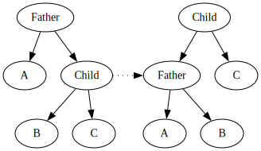
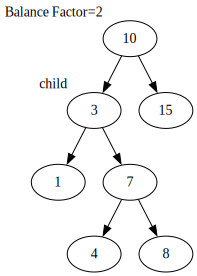
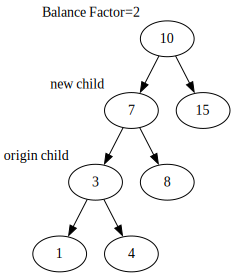
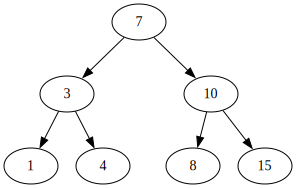

在本文中，我将详细介绍 AVL 树这一自平衡二叉查找树的基本概念、核心原理以及其操作过程，
帮助读者理解其如何保持高效的查询、插入和删除操作。
同时，我还将通过代码示例演示 AVL 树的实现，并分析其在实际应用中的优势与局限。
本文适合那些有一定数据结构基础，并希望深入了解自平衡树及其应用的读者。

<!-- more -->

## 什么是 AVL 树？

**AVL 树**是计算机科学中最早被发明的平衡二叉树。
它通过**平衡因子 (Balance Factor)** 来衡量树的平衡程度，并通过**树旋转**来维护平衡。

AVL 树得名于它的发明者 G. M. Adelson-Velsky 和 E. M. Landis。

## 平衡因子

==平衡因子==是 AVL 树用来衡量自身平衡程度的标准。

一个节点的平衡因子定义为节点*左右子树的高度差*。
当节点的平衡因子绝对值小于等于$1$时，称该节点为==平衡节点==，否则为==失衡节点==。
AVL 树中所有的节点都是平衡节点。

::: note AVL 树的高度

设 $f_h$ 为高度 $h$ 的 AVL 树所包含的最少节点数，则

$$
f_h =
\begin{cases}
    1, & h = 1 \\
    2, & h = 2 \\
    f_{h-1} + f_{h-2} + 1, & h \ge 3
\end{cases}
$$

显然，$\{f_h + 1\}$ 是一个斐波那契数列。我们可以算出它的通项为

$$
f_h = \frac{5+2\sqrt{5}}{5} (\frac{1+\sqrt{5}}{2})^h + \frac{5-2\sqrt{5}}{5} (\frac{1-\sqrt{5}}{2})^h - 1
$$

当 $h$ 足够大时

$$
f_h \sim \frac{5+2\sqrt{5}}{5} (\frac{1+\sqrt{5}}{2})^h
$$

因此，对于有 $n$ 个节点的 AVL 树，其高度

$$
h \le \log_{\frac{1+\sqrt{5}}{2}}{\frac{5}{5+2\sqrt{5}} n} = O (\log n)
$$

因此 AVL 树的高度为 $O(\log n)$，始终能保持较好的平衡。

:::

## 树旋转

在 AVL 树中，插入或删除节点会改变树的高度，产生失衡节点。
这时，我们用==树旋转==来重新维护节点的平衡。

由于修改前 AVL 的节点平衡因子大小不超过 $1$，如果平衡被破坏，
则失衡节点的平衡因子只可能是 $\pm 2$。

### 左旋与右旋

根据旋转方向的不同，我们可以把树旋转分为==左旋==和==右旋==。

左旋是将父节点经旋转变成左儿子，而其原先的右儿子变成新的父节点的过程。

::: center

:::

右旋则与左旋相反，是将父节点变成右儿子，原先的左儿子变成新的父节点的过程，相当于做一次左旋的逆变换。

### 不同旋转策略的采用

我们自底向上研究节点变化后的 AVL 树，找到第一个失衡节点，称该节点为 node。
该节点必有子节点，称其中高度较大的子节点为 child。

根据 node 与 child 平衡因子情况的不同，我们要采取不同的旋转策略。

| 失衡节点的平衡因子 | 子节点的平衡因子 | 所属情况 | 应采取的旋转方法 |
| :----------------: | :--------------: | :------: | :--------------: |
|      $\gt 1$       |     $\ge 0$      |    LL    |       右旋       |
|      $\gt 1$       |     $\lt 0$      |    LR    |   先左旋后右旋   |
|      $\lt -1$      |     $\le 0$      |    RR    |       左旋       |
|      $\lt -1$      |     $\gt 0$      |    RL    |   先右旋后左旋   |

> [!note]
> 上表中“右旋”指仅右旋 node ，“先左旋后右旋”则是先左旋 child 后右旋 node，其他同理。
>
> LR 可理解为 node 节点的左子树偏大，而 child 节点的右子树偏大。

:::: details 示例

::: center

:::

在上图中，node 为 10，child 为 3。
其中 node 的左子树较大， child 的右子树较大，属于 LR，因此要先左旋后右旋。

首先，我们对 3 进行一次左旋，得到下面的树结构。

::: center

:::

> [!note]
> 实际上，这里我们通过对 child 节点的左旋操作，将 LR 转化成了 LL。

然后，我们再对 10 进行一次右旋，最终得到平衡后的 AVL 树。

::: center

:::

::::

## AVL 树的相关操作

有了对[平衡因子](#平衡因子)和[树旋转](#树旋转)的了解后，要理解 AVL 树的相关操作就非常容易了。

### 查找

AVL 树的查找不涉及任何节点操作，因此与普通的二叉平衡树无异。这里就不再过多赘述。

### 插入

AVL 树在进行一次插入操作后可能会产生失衡节点。
我们需要在插入节点的位置向上搜索，找出所有可能的失衡节点，进行树旋转。

::: note

一次插入可能会产生多个失衡节点，因此我们要一直向上回溯至根节点，确保所有节点都是平衡节点。
在回溯的同时，也要注意更新节点的平衡因子。

:::

### 删除

AVL 树的删除也与二叉搜索树类似：
如果被删除的节点是叶子节点，直接将其删除；否则，将节点与其后继节点交换，再删除交换后的节点。

与插入相同，删除也会带来平衡因子的更新，因此需要沿着被删除节点到根节点的路径遍历，重新维护平衡。

## 代码实现

@[code cpp:collapsed-lines](code/avl_tree.h)

也可以在我的 [Github 仓库](https://github.com/SuniRein/common-data-structure/blob/main/src/avl_tree.h)上查看，仓库上的实现可能会更新一点。

## 与红黑树的比较

AVL 树与红黑树都是计算机科学中常见的平衡树类型，因此常被用来比较。

事实上，每一颗 AVL 树都可以被染色成红黑树，但红黑树不一定是 AVL 树。
也就是说，AVL 树的平衡要求比红黑树更严格。
因此，AVL 树查找性能相对较好，但插入和删除效率则会偏低。

AVL 树更适合插入删除次数少、查找次数多的场景，红黑树则更胜任于频繁查删的场景。
Windows NT 内核中就广泛使用了 AVL 树，而 C++ 标准库里的 `std::map` 和 `std::set` 则是用红黑树实现的。

## 参考资料

- [算法与数据结构——AVL 树（平衡二叉搜索树）| 博客园](https://www.cnblogs.com/1873cy/p/18395797)

- [AVL 树 | OI Wiki](https://oi-wiki.org/ds/avl/)
