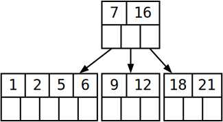

在本文中，我将深入解析 B 树这一广泛应用于数据库与文件系统的多路平衡搜索树。
与传统的二叉树不同，B 树通过多分支和高扇出的特性，显著减少磁盘 I/O 次数，从而高效管理海量数据。
本文将系统讲解 B 树的核心设计思想、平衡维护机制及其关键操作（查找、插入、删除），
探讨 B 树的适用场景，帮助读者理解其在大规模存储系统中的核心地位。

<!-- more -->

::: note
有些文章中会把 B 树写作 B-树，这来源与 B 树的英文 B-tree。
我个人认为这种写法不是很好，容易被误解为是“B 减树”，但其实这里的 '-' 只是表示连接的意义，并不是作为减号。
:::

## 什么是 B 树？

B 树是一种多路平衡搜索树，广泛应用于数据库系统和文件系统中，特别是在需要频繁进行磁盘读写操作的场景中。
不同于常见的二叉平衡树，B 树中的一个节点能存放多个数据，且具有多个子节点。

:::center

:::

## B 树的核心特性

### 节点结构

在 B 树中，节点可以分为==内部节点==和==叶子节点==。
内部节点存储数据和指向子节点的指针，而叶子节点只存储数据，不存储指针。

通常来说，一个存有 $n$ 个数据的内部节点有 $n+1$ 个子节点，反之亦然。

B 树节点内部的数据在维持自身有序性的同时，与子节点也存在一定的有序性。
**对于一个升序节点中的第 $n$ 个关键字，第 $n$ 个子节点中的关键字全部小于它，第 $n+1$ 个子节点中的关键字全部大于它。**
因此，我们可以将这 $n+1$ 个子节点看作恰好散落插入在 $n$ 个节点数据中。

### 阶数

B 树中节点允许的最大度值称为 B 树的==阶数==（Order），它是 B 树的一个重要特性。[^Order]

一棵 $m$ 阶的 B 树具有以下性质：

1. 每个节点最多有 $m - 1$ 个关键字和 $m$ 个子节点。
1. 除根节点外，每一个非叶子节点最少有 $\lfloor \frac{m}{2} \rfloor$ 个子节点。
1. 如果根节点不是叶子节点，那么它至少有两个子节点。
1. 所有的叶子节点位于同一层。

[^Order]:
    在有些文献中，B 树的阶数被定义为最大关键字个数，与本文所采用的定义略有不同。
    还有些文献采用节点的最小度数来定义 B 树的阶数。

### 节点分裂与节点合并

B 树通过==节点分裂==和==节点合并==来维护其平衡性，这两种操作是 B 树区分于传统二叉树的特有机制。

#### 节点分裂

在执行插入操作时，若某个节点的关键字数量超过上限，则需要分裂。

::: steps

1. 定位中间关键字。

1. 创建两个左右子节点。

   左节点保留中间关键字之前的关键字和对应的子节点，右节点保留中间关键字之后的关键字和对应的子节点。

1. 提升中间关键字。

   将中间关键字插入到父节点中，若不存在父节点则创建一个。
   同时，删除父节点中原有节点的指针，建立父节点到左右节点的连接。

1. 递归检查父节点。

   由于中间关键字的插入，父节点可能发生溢出，需继续分裂直至满足条件。

:::

#### 节点合并

在执行删除操作时，若某个节点的关键字低于下限，则需要合并。

::: steps

1. 判断兄弟节点可否借取。

   若**邻近**的兄弟节点有富余的关键字，可以向它们借取一个，同时调整对应的关系。
   否则，需要合并。

1. 合并兄弟节点。

   选取一个相邻的兄弟节点，以及父节点中对应的关键字，合并为一个新的节点，然后重新调整父节点与新节点的关系。

1. 递归检查父节点。

   合并完后父节点可能因关键字下移而不足，需继续合并直至满足约束。

   若父节点为根节点且合并后为空，删除父节点，选择合并后的新节点为新根。此时树高减少。

:::

## B 树的基本操作

### 查找

B 树的查找过程类似于二叉搜索树，我们从根节点开始，自顶向下逐步搜索，直至找到目标关键字。
不同之处在于由于每个节点拥有多个关键字，我们需要遍历这些关键字来确定要查找节点所在的位置。

### 插入

::: steps

1. 检验存在性。

   插入一个元素时，首先要验证该元素在 B 树中是否存在。

2. 寻找要插入的叶子节点。

   **插入操作一定发生在叶子节点**。
   我们自顶向下搜索，找到能用来插入该节点的叶子节点。

3. 插入关键字。

   在叶子节点中找到合适的位置，插入该关键字。
   此时如果溢出，则进行[节点分裂](#节点分裂)。[^插入时的分裂]

:::

[^插入时的分裂]: 有时为了实现的方便，会选择先分裂后插入。

### 删除

相比插入操作，删除操作实现起来较为复杂。

::: steps

1. 定位要被删除的关键字。

1. 借位策略。

   当被删除的关键字位于非叶子节点时，用前驱或后驱替换之[^前驱或后继]，目标节点改为前驱或后继所在节点。
   **前驱与后继必然位于叶子节点上。**

1. 删除关键字。

   此时目标节点必然为叶子节点，删除时只需重新调整关键字的顺序。
   若删除后关键字的数量不足，则进行[节点合并](#节点合并)。

:::

[^前驱或后继]: 因为位于非叶子节点上，所以前驱或后继必然存在。

## 为什么需要 B 树

### 磁盘 I/O 的瓶颈与二叉树的局限性

传统二叉树在处理大规模数据存储上具有天然劣势。

大数据一般存储在磁盘上，相比键值比较所用的时间，从磁盘上读取数据的时间占支配地位。
磁盘上的数据检索以页作为基本单位，当分页大小为 4KB 时，读取 1B 数据和读取 4KB 数据都需要进行一次磁盘 I/O，耗时几乎相同。
而像 AVL 树、红黑树这种二叉树结构，每个节点可能分布在不同的磁盘页上，一次访问需要进行多次磁盘 I/O。

B 树的每个节点可以存储大量关键字，连续分布在相同的磁盘页上，仅需进行一次 I/O，读取效率高。
而且它能有效较少树高，降低一次查询中磁盘 I/O 的次数，大大提高查询性能。

### 自平衡机制的稳定性

AVL 树、红黑树通过旋转操作维护平衡，但旋转可能涉及多个节点调整（例如子树的高度变化）。
B 树通过节点分裂和节点合并实现平衡，操作仅影响局部节点，减少全局调整的开销。

此外，B 树的平衡还是自适应的，不需要像 AVL 树、红黑树那样维护额外的节点信息。

### 局部性原理的充分利用

现代 CPU 普遍采用缓存机制，访问连续内存的时间要比随机访问快得多。
B 树高扇出与局部性优化的特性，充分利用了局部性原理，在现代 CPU 多级缓存架构下同样展现出显著优势。
在很多场合下，B 树表现出优于传统 BST 的性能。

新兴语言 Rust 标准库的 `BTreeMap` 采用 B 树来实现，正是基于这个原理。[^BTreeMap]

[^BTreeMap]: 见 <https://rustwiki.org/zh-CN/std/collections/struct.BTreeMap.html>。

## B 树的应用

### 数据库索引

主流数据库（如 MySQL、PostgreSQL）普遍使用 ==B+ 树==（B 树的变种）作为索引结构。

### 文件系统

文件系统（如 NTFS、ReiserFS）用 B 树管理目录和文件块指针。

### 内存受限的嵌入式系统

B 树的高扇出特性在内存中能减少指针数量，降低内存碎片。

## 参考资料

- [B 树 | 维基百科](https://zh.wikipedia.org/wiki/B%E6%A0%91/)
- [B 树 | OI Wiki](https://oi-wiki.org/ds/b-tree/)
- [B 树详解与实现 | 知乎专栏](https://zhuanlan.zhihu.com/p/463641767)
